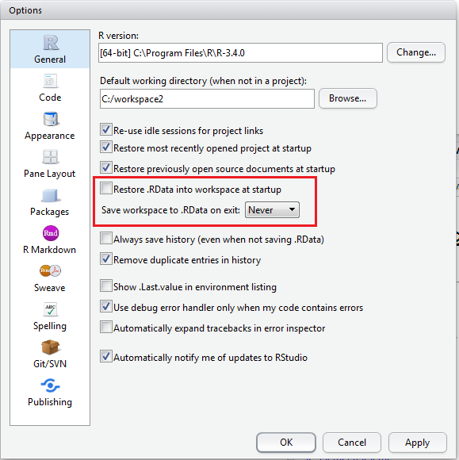
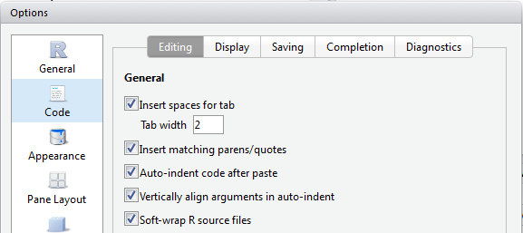
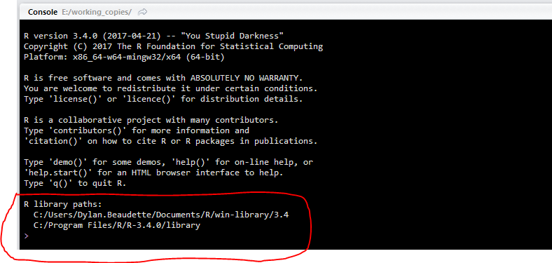

# Pre-course Assignment
Dylan Beaudette, Stephen Roecker, Tom D'Avello  
`r Sys.Date()`  

1. **View** Paul Finnel's [webinar](https://youtu.be/VcdowqknChQ)

2. **Create** a folder on your machine to be used as the working directory for this course at `C:\workspace`. Use all lower case letters please.

3. Open **RStudio**, and change your Global Options (Tools>Global Options):

- **Change** the default working directory to `C:\workspace` (R General Tab)
- **Uncheck** "Restore .Rdata into workspace at startup" (R General Tab)

 

- Check "Soft-wrap R source files" (Code/Editing Tab)

 

4. **Install** the necessary additional packages by **copying and pasting** the following code in the box below into the R console window after the command prompt (>) and hit **enter**. This doesn't require admin privileges. Depending on your network connection this could take a while. *Hint: the R console is the lower left or left window in RStudio with a tab labeled "Console".* If this is the first time you've installed a package, R will ask you if you want to create a local repository in your My Documents folder. Click **Yes**.

  


```r
source('https://raw.githubusercontent.com/ncss-tech/soilReports/master/R/installRprofile.R')
installRprofile()

dir.create(path="C:/workspace", recursive = TRUE)

# helper fuction for installing required packages from CRAN
# a simple check is done to see if each is already installed
# p: vector of package names
# up: logical- upgrade installed packages?
ipkCRAN <- function(p, up){
  if(up) {
    install.packages(p, dependencies = TRUE)
  } else {
    new.pkg <- p[! (p %in% installed.packages()[, "Package"])]
    if (length(new.pkg) > 0) {
      message('installing packages from CRAN...')
      install.packages(new.pkg, dependencies = TRUE)
    }
  }
}


## list of packages
packages <- c("devtools","aqp", "soilDB", "sharpshootR", "Rcpp", "clhs", "circular", "Rcmdr", "fBasics", "car", "rms", "randomForest", "rpart", "party", "caret", "knitr", "markdown", "gdalUtils", "raster", "rgdal", "sp", "spatial", "shape", "shapefiles", "digest", "plyr", "dplyr", "httr", "reshape", "reshape2", "stringr", "stringi", "cluster", "ape", "lattice", "latticeExtra", "ggplot2", "RColorBrewer", "plotrix", "rpart.plot", "Matrix")

## install
ipkCRAN(packages, up=TRUE)

## install the latest version of packages from the AQP suite:
devtools::install_github("ncss-tech/aqp", dependencies=FALSE, upgrade_dependencies=FALSE)
devtools::install_github("ncss-tech/soilDB", dependencies=FALSE, upgrade_dependencies=FALSE)
devtools::install_github("ncss-tech/sharpshootR", dependencies=FALSE, upgrade_dependencies=FALSE)
install.packages("printr", type = "source", repos = c("http://yihui.name/xran", "http://cran.rstudio.com"))

## load packages in the list
sapply(packages, library, character.only = TRUE, quietly = TRUE, logical.return = TRUE)
```

If the above process completed successfully, you should see an R folder in your actual **C:/Users/user.name/Documents** folder. In this folder you should see all the packages that were installed. We installed the packages in this new library folder in order to avoid placing them in your HOME directory, which for many USDA computers has now been redirected to a server or cloud. This will greatly increase the speed with which we are able to load and download packages. In order for R to notice the new library location, we've placed an ".Rprofile" file in your redirected HOME directory (My Documents). The .Rprofile file is designed to customize your R installation. Each time RStudio is opened it will search for your installed packages and adjust your R session according. You can check the location of your R library by typing `.libPaths()` into the R console, which should say `[1] "C:/Users/user.name/Documents/R/win-library/3.3" "C:/Program Files/R/R-3.2.1/library"`.

5. Establish an ODBC connection to NASIS by following the directions at the following hyperlink ([ODBC Connection to NASIS](http://ncss-tech.github.io/AQP/soilDB/setup_local_nasis.html)).

Once you've successfully established a ODBC connection, prove it by loading your NASIS selected set with the site and pedon tables for any user pedon id (e.g. 11CA794317), run `fetchNASIS()` in the R console like the example below, and submit your results to Tom D'Avello.


```r
# Example

library(soilDB)

test <- fetchNASIS()

str(test, max.level = 2)
```

6. Follow the one line example below, copy the output, and submit the results to Tom D'Avello. This should spit back a report of all the packages you downloaded.


```r
# Example
sessionInfo()
```

7. Additional Support/Optional Readings

- [AQP Website](http://ncss-tech.github.io/AQP/)
- [Stats for Soil Survey Webinar](https://www.youtube.com/watch?v=G5mFt9k37a4)
- [Soil Data Aggregation using R Webinar](https://www.youtube.com/watch?v=wD9Y0Qpv5Tw)
