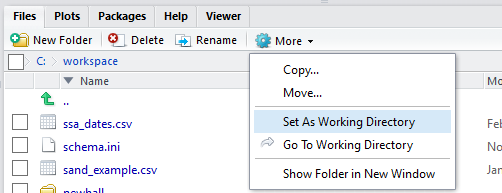
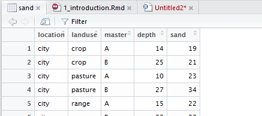
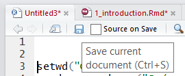
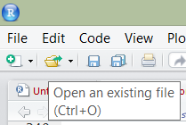
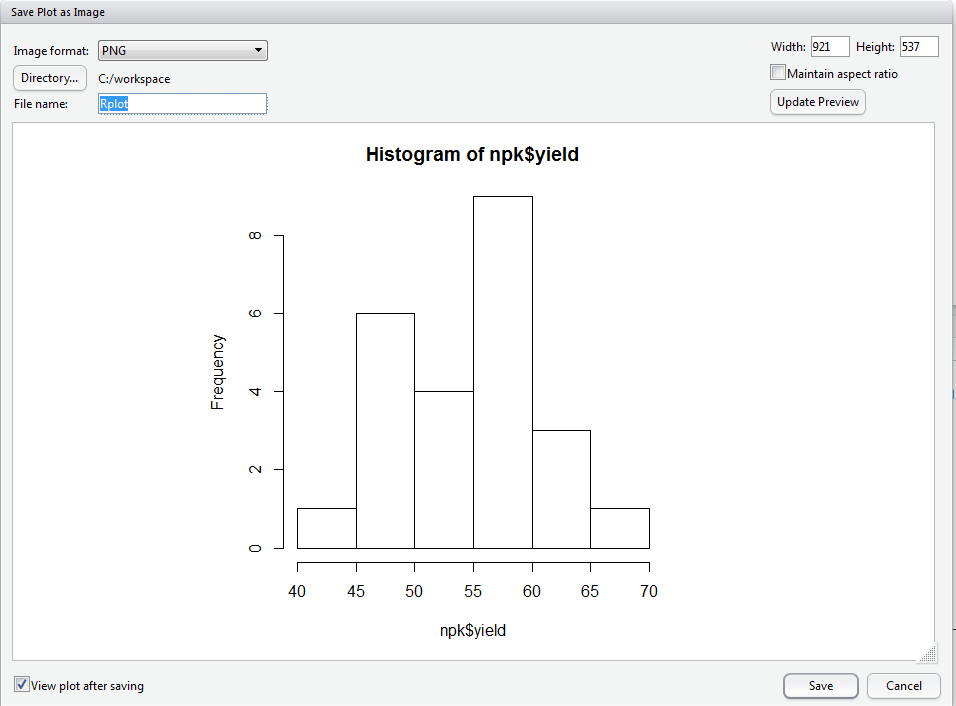

# Chapter 1 Introduction to R and RStudio
Stephen Roecker, Katey Yoast, and Skye Wills  
`r Sys.Date()`  


# Introduction

R is a free, open-source software and programming language developed in 1995 at the University of Auckland as an environment for statistical computing and graphics [(Ikaha and Gentleman, 1996)](https://www.stat.auckland.ac.nz/~ihaka/downloads/R-paper.pdf). Since then R has become one of the dominant software environments for data analysis and is used by a variety of scientific disiplines, including soil science, ecology, and geoinformatics ([Envirometrics CRAN Task View](https://cran.r-project.org/web/views/Environmetrics.html); [Spatial CRAN Task View](https://cran.r-project.org/web/views/Spatial.html)). R is particularly popular for its graphical capabilities, but it is also prized for it's GIS capabilities which make it relatively easy to generate raster-based models. More recently, R has also gained several packages which are designed specifically for analyzing soil data. While the vast majority of people use Microsoft Excel for data analysis, R offers numerous advantages, such as:

- reproducibility (numerous Excel horror stories of scientific studies gone wrong exist)([TED Talk](https://www.youtube.com/watch?v=dXKbkpilQME))
- large community of users that contribute disipline specific functionality, including soil science and ecology

While some people find the use of a commandline environment daunting, it is becoming a necessary skill for scientists as the volume and variety of data has grown. Thus scripting or programming has become a third language for many scientists, in addition to their native language and disipline specific terminology. Other popular programming languages include: Python, JavaScript, and SQL. 

<!-- -->


# RStudio

RStudio is an integrated development environment (IDE) that allows you to interact with R more readily. RStudio is similar to the standard RGui, but is considerably more user friendly. It has more drop-down menus, windows with multiple tabs, and many customization options. The first time you open RStudio, you will see three windows. A forth window is hidden by default, but can be opened by clicking the **File** drop-down menu, then **New File,** and then **R Script.**. Detailed information on using RStudio can be found at at [RStudio's Website](https://support.rstudio.com/hc/en-us/sections/200107586-Using-RStudio).
 

RStudio Windows / Tabs  | Location    | Description                     |
------------------------|-------------|---------------------------------|
Console Window          | lower-left  | location were commands are entered and the output is printed |
Source Tabs             | upper-left  | built-in text editor |
Environment Tab         | upper-right | interactive list of loaded R objects |
History Tab             | upper-right | list of key strokes entered into the Console |
Files Tab               | lower-right | file explorer to navigate C drive folders |
Plots Tab               | lower-right | output location for plots  |
Packages Tab            | lower-right | list of packages and links to package specific help files |
Help Tab                | lower-right | output location for help commands and help search window |
Viewer Tab              | lower-right | advanced tab for local web content |


  


## USDA Computer Setup

R and RStudio have been installed on all USDA computers which have NASIS installed. R and RStudio are typically updated and CCE-approved once a year. The versions on USDA machines may be one to three releases behind the latest version available for public download. Having an outdated version of R  rarely creates a problem, although warnings may appear.  


## Basic Tips for using R  

- R is command-line driven. It requires you to type or copy-and-paste commands after a command prompt (>) that appears when you open R. After typing a command in the R console and pressing **Enter** on your keyboard, the command will run. If your command is not complete, R issues a continuation prompt (signified by a plus sign: `+`). Alternatively you can write a script in the script window, and select a command, and click the **Run** button. 

- R is case sensitive. Make sure your spelling and capitalization are correct.  
 
- Commands in R are also called functions. The basic format of a function in R is: `function.name(argument, options)`.  
 
- The up arrow (^) on your keyboard can be used to bring up previous commands that you've typed in the R console. 
 
- The `$` symbol is used to select a particular column within the table (e.g., `table$column`).

- Any text that you do not want R to act on (such as comments, notes, or instructions) needs to be preceded by the `#` symbol (a.k.a. hash-tag, comment, pound, or number symbol).  R ignores the remainder of the script line following `#`. For example:  
 
`plot(x, y) # This text will not affect the plot function because of the comment`

### Brief Example


```r
# Addition
1 + 1
```

[1] 2

```r
# Multiplication
10 * 10
```

[1] 100

```r
# Compute Logarithm
log10(100)
```

[1] 2

```r
# Print Text
"Hello World"
```

[1] "Hello World"

```r
# Plot Histogram
hist(npk$yield)
```

<!-- -->


## Data Management in RStudio  

Before you begin working in R, should set your working directory (a folder to hold all of your project files); for example, "C:\\workspace\\...". This directory is the location where all your input data-sets and R scripts are be stored. It also serves as the default location for plots and other objects exported from R. If set, it conviently allows you to import data into R with just a file name, not the entire file path.

Typically at the beginning of each R session you should set your working directory. To change the working directory in RStudio, select the **Files Tab > More > Set As Working Directory**. 





This can be accomplished in the Console by typing:


```r
setwd("C:/workspace")

# beware R uses forward slashes / instead of back slashes \ for file path names
```

To check the file path of the current working directory (which should now be "C:\\workspace"), type:


```r
getwd()
```


### Importing Data

After your working directory is set, you can import data from .csv, .txt, etc. One basic command for importing data into R is `read.csv()`. The command is followed by the file name and then some optional instructions for how to read the file.    

First, create an example file by copying the contents below. Paste the content into Notepad and save the file as sand_example.csv in your C:\\workspace folder.  

location,landuse,horizon,depth,sand  
city,crop,A,14,19  
city,crop,B,25,21  
city,pasture,A,10,23  
city,pasture,B,27,34  
city,range,A,15,22  
city,range,B,23,23  
farm,crop,A,12,31  
farm,crop,B,31,35  
farm,pasture,A,17,30  
farm,pasture,B,26,36  
farm,range,A,15,25  
farm,range,B,24,29  
west,crop,A,13,27  
west,crop,B,29,25  
west,pasture,A,11,21  
west,pasture,B,31,26  
west,range,A,14,23  
west,range,B,24,24  

This dataset can either be simply imported into R using the **Import Dataset** button from the Environment tab, or by typing the following command into the R console:  


```r
sand <- read.csv("C:/workspace/sand_example.csv") 

# if your workspace was already set you could simply use the filename, like so

# sand <-read.csv("sand_example.csv")
```
#### Note on Excel files

R can import Excel files, but generally speaking it is a bad to use Excel. Excel has a dangerous default which automatically converts data with common notations to their standard format without warning or notice. For example, the character "11-JUN" entered into a cell automatically becomes the date 6/11/2017, even though the data is still displayed as 11-JUN. The only way to avoid this default behavior is to manually import your data into Excel via the **Data Tab>Get External Data Ribbon**, and manually set the data type of all your columns to text. Failure to do so has resulted in numerous retracted research articles ([Washington Post Article](https://www.washingtonpost.com/news/wonk/wp/2016/08/26/an-alarming-number-of-scientific-papers-contain-excel-errors/?utm_term=.9352a35dca6f)). 


### Exporting Data

To export data from R, use the command `write.csv()`. Since we have already set our working directory, R automatically saves our file into the working directory.  


```r
write.csv(sand, file = "sand_example2.csv")

# or use the write.table() function to export other text file types
```


### Viewing and Removing Data

Once the file is imported, it is imperative that you check to ensure that R correctly imported your data. Make sure numerical data are correctly imported as numerical, that your column headings are preserved, etc. To view data simply **click** on the sand dataset listed in the Environment tab. This will open up a separate window that displays a spreadsheet like view.




Additionally you can use the following functions to view your data in R.

Function  | Description                                         |
----------|-----------------------------------------------------|
`print()` | prints the entire object (avoid with large tables)  |
`head()`  | prints the first 6 lines of your data               |
`str()`   | shows the data structure of an R object             |
`names()` | lists the column names (i.e., headers) of your data |
`ls()`    | lists all the R objects in your workspace directory |


Try entering the following commands to view the sand dataset in R: 


```r
str(sand)

names(sand)

head(sand)

ls()
```

A data object is anything you've created or imported and assigned a name to in R. The Environment tab allows you to see what data objects are in your R session and expand their structure. Right now sand should be the only data object listed. If you wanted to delete all data objects from your R session, you could **click the broom icon** from the Environments tab. Otherwise you could type:


```r
# Remove all R objects
rm(list = ls(all = TRUE)) 

# Remove individal objects
rm(sand)
```


## Getting Help 

R has extensive documentation, numerous online communities, and countless books (many which are free and listed at end of each chapter for this course). The built in help files are sometimes cryptic, and the online replies can be terse, but if you seek help you shall find it. To learn more about the function you are using and the options and arguments available, take advantage of some of the following help functions in RStudio:

1. Use the Help tab in the lower-right Window to search commands (such as hist) or topics (such as histogram). 


2. Just as in R, you can type `help(hist) or ?hist` in the Console window to bring up a help page. Results will appear in the Help tab in the lower-right hand window. 
    - The help tab may also be triggered after typing a command (such as hist) in the Console window, by placing your cursor at the end of the function and press **F1** on your keyboard to bring up more information about the command. 
    - Certain functions may require quotations, such as `help("+")`.


```r
# Example

help(read.csv) 

# or

?read.csv
```


## Exercise

Read the help file for `read.csv()` and determine how you would disable the first row in the sand dataset from being intrepreted as a header.


## Packages

Packages are collections of additional functions that can be loaded on demand. They commonly include example data that can be used to demonstrate those functions. Although R comes with many common statistical functions and models, most of our work requires additional packages.


### Installing Packages

To use a package, you must first install it and then load it. These steps can be done at the command line or using the Packages Tab. Examples of both approaches are provided below. R packages only need to be installed once (until R is upgraded or re-installed). Every time you start a new R session, however, you need to load every package that you intend to use in that session.  

Within the **Packages** tab you will see a list of all the packages currently installed on your computer, and 2 buttons labeled either "Install" or "Update". To install a new package simply select the **Install** button. You can enter install one or more than one packages at a time by simply separating them with a comma.   

  


To find out what packages are installed on your computer, use the following commands:


```r
library() 

#or

installed.packages()
```

One extremely useful package for soil scientists is the soiltexture package, which as you would expect allows you to plot soil textural triangles. The following command shows how to install this package if you do not have currently have it downloaded:  


```r
install.packages("soiltexture", dep = TRUE) # dep=TRUE will install all packages that "soiltexture" depends on to work correctly
```


### Loading Packages

Once a package is installed, it must be loaded into the R session to be used. 


```r
library(soiltexture)
```

You can also load packages using the **Packages Tab**, by **checking** the box next to the package name. Documentation about the soiltexture package is available from the help functions in R. 


```r
help(package = "soiltexture")
```

This help command sends you to a webpage. Scroll down and select the link "TT.plot". This link brings up a webpage that has instructions on how to use the `TT.plot()` function in R. 

The basic usage of the `TT.plot()` function is: TT.plot(class.sys, tri.data). The "class.sym" argument specifies a character string naming the textural classificaiton system.


```r
# Copied from soiltexture vignette
# Create a dummy data frame of soil textures:
example <- data.frame(
"CLAY" = c(05,60,15,05,25,05,25,45,65,75,13,47),
"SILT" = c(05,08,15,25,55,85,65,45,15,15,17,43),
"SAND" = c(90,32,70,70,20,10,10,10,20,10,70,10),
"OC" = c(20,14,15,05,12,15,07,21,25,30,05,28)
) 

TT.plot( class.sys = "USDA.TT", tri.data = example)
```

<!-- -->

For more examples see the the [soiltexture vignette](http://cran.r-project.org/web/packages/soiltexture/vignettes/soiltexture_vignette.pdf). Vignettes are a short tutorials that provide detailed examples and descriptions of packages. Unfortunately not all packages come with a vignette.


## Working with Scripts  


## Saving R Files  

In R, you can save several types of files to keep track of the work you do. The file types include: workspace, script, history, and graphics. It is important to save often because R, like any other software, may crash periodically. Such problems are especially likely when working with large files. You can save your workspace in R via the command line or the File menu.  


### R script (.R)

An R script is simply a text file of R commands that you've typed. 

You may want to save your scripts (whether they were written in R Editor or another program such as Notepad) so that you can reference them in the future, edit them as needed, and keep track of what you've done. To save R scripts in RStudio, simply **click the save button** from your R script tab. Save scripts with the .R extension. R assumes that script files are saved with only that extension. If you are using another text editor, you won't need to worry about saving your scripts in R. You can always copy them from your text editor and then paste them into the R Console or R Editor.  

  

To open an R script, **click the file icon**.  




### Workspace (.Rdata)  

The R workspace consists of all the data objects you've created or loaded during your R session. When you quit R by either typing `q()` or exiting out of the application window, R will prompt you to save your workspace. If you choose yes, R saves a file named .RData to your working directory. The next time you open R and reload your .Rdata workspace, all of your data objects will be available in R and all of the commands that you've typed will be accessible by using the up-arrow and down-arrow keys on your keyboard. You can also save or load your workspace at any time during your R session from the menu by clicking **Session>Save Workspace As..**, or the save button on the **Environment Tab**.   

    

The R command for saving your workspace is:

```r
save.image(file="workspace.RData")
```

### R history (.Rhistory) 

An R history file is a copy of all your key strokes. You can think of it as brute force way of saving your work. It can be useful if you didn't document all your steps in an R script file. Like an R file, an Rhistory file is simply a text file that lists all of the commands that you've executed. It does not keep a record of the results. To load or save your R history from the History Tab click the **Open File** or **Save** button. If you load an Rhistory file, your previous commands will again become available with the up-arrow and down-arrow keys.

 

You can also use the command line to load or save your history.  


```r
savehistory(file = "sand.Rhistory")  
loadhistory(file = "sand.Rhistory")  
history(max.show=Inf) #displays all previous commands
```

### R Graphics   

Graphic outputs can be saved in various formats. 
 

Formats           Function                    
----------------  ----------------------------
pdf               pdf("graphic.pdf")          
window metafile   win.metafile("graphic.wmf") 
png               png("graph.png")            
jpeg              jpeg("graph.jpg")           
bmp               bmp("graph.bmp")            
postscript        postscript("graph.ps")      

To save a graphic: (1) Click the **Plots Tab** window, (2) click the **Export** button, (3) **Choose** your desired format, (3) **Modify** the export settings as you desire, and (4) click **Save**.  

  

The R command for saving a graphic is:  


```r
png(file = "npk_yield.png")
plot(npk$yield)
dev.off()
```

png 
  2 

The first line of this command creates a blank file named sand with a JPEG extension.  The second line plots the data object that you want to create a graphic of (here it is conveniently the same name as the JPEG file we are creating). The third line closes the graphics device.  


# Rcmdr (R Commander): A Graphical User Interface for R

While we recommend the use of RStudio for some of the reasons listed above, many people new to R might benefit from a graphical user interface (GUI) that allows users to run basic functions using a point and click interface. Luckily for beginners R has the R Commander (Rcmdr) GUI, which is similiar to [JMP](https://www.jmp.com/en_us/learning-library/using-jmp.html). Rcmdr was created by [John Fox](http://socserv.socsci.mcmaster.ca/jfox/Misc/Rcmdr/index.html) for his introductory statistics students so they could see how the software worked without learning a large number of function names and arguments. Rcmdr is a great way to begin familiarizing yourself with R and statistics within a GUI environment. Regretable we know of no GUI that allows users to perform the majority of soil survey applications demonstrated in this course, and thus won't Rcmdr won't be covered. For those who wish to pursue Rcmdr, alternative instructions can be viewed at [Andy Chang & G. Jay Kerns website](http://gchang.people.ysu.edu/r/R_Instructions.htm).

To take a quick peak at Rcmdr, it can be opened by **entering** the following command into the R console.


```r
install.packages(Rcmdr)
library(Rcmdr)
```

  

# Review

Given what you now know about R, try to answer the following questions:

1. How can the `str()` function be used?

2. What are packages?

3. Which R function is used to load packages?

4. What types of files can you save in R? 

5. What would be the result of `plot(clay ~ organiccarbon, data=KSSL)`?


# Additional Resources  
- [R Manuals](http://cran.r-project.org/manuals.html)
- [Comprehensive R Archive Network (CRAN) Task View](https://cran.r-project.org/web/views/)
- [Quick R](http://www.statmethods.net/)  
- [Algorithms for Quantitative Pedology and Working with NRCS soil databases](http://ncss-tech.github.io/AQP/)
- [California Soil Resource Lab](http://casoilresource.lawr.ucdavis.edu/software/r-advanced-statistical-package/)
- [David Rossiter's R Applications and Lecture Notes](http://www.css.cornell.edu/faculty/dgr2/)
- [R for Digital Soil Mapping by Brendan Malone](http://www.clw.csiro.au/aclep/documents/DSM%20Workshop%20Manual.pdf)
- [Geographic Data Analysis and Visualization: Topics and Examples](http://geog.uoregon.edu/geogr/topics/)
- [Stack Overflow (discussion forum that includes R questions)](http://stackoverflow.com/)
- [ncss-tech Google + Group (e.g. Soil Survey R Users)](https://plus.google.com/u/0/communities/101713042265696005456)  


# References

- Ihaka, R., and R. Gentleman. 1996. R: A language for data analysis and graphics. Journal of Computational and Graphical Statistics 5(3):399–314. [https://www.stat.auckland.ac.nz/~ihaka/downloads/R-paper.pdf](https://www.stat.auckland.ac.nz/~ihaka/downloads/R-paper.pdf)  
