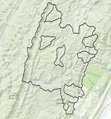
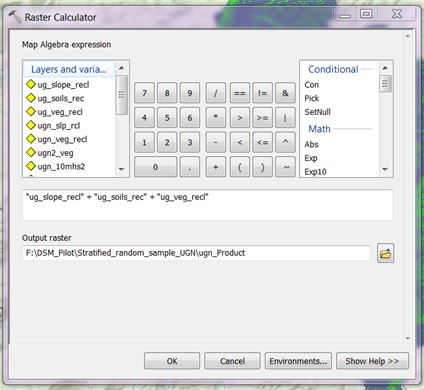
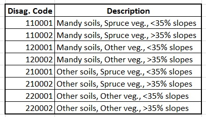
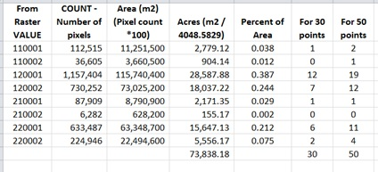
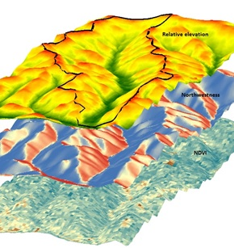
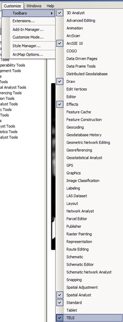
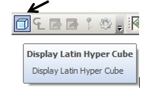

---
title:
author:
date: "Friday, February 27, 2015"
output: html_document
html_document:
    keep_md: yes
---
  

##CHAPTER 3: SAMPLE DESIGN  

 * [3.1 Simple Random](#rand)  
 * [3.2 Systematic](#sys)   
 * [3.3 Stratified Random](#strat)  
 * [3.4 Two-stage Random](#two)      
 * [3.5 Tools for selecting Random features](#tools)    
 * [3.6 Example of a two stage stratified random sample design using ArcGIS](#ex1)  
 * [3.7 Conditioned Latin hypercube (cLHS)](#clhs)
 * [3.8 cLHS example using TEUI](#ex2)  
 * [3.9 How many samples are needed?](#sampnum)  
 * [3.10 References](#ref)  
 

####Sampling   

Sampling is a fundamental part of statistics. Samples are collected to achieve an understanding of the population, as it is usually not feasible to observe all members of a population. The goal is to collect samples that provide an accurate representation of the population under study. Time and money dictate that the sampling effort be efficient. Highly variable populations will require more samples to characterize their nature.  

**Define your purpose** – are you investigating soil properties, soil classes, plant productivity, etc.?   

**Expected variability** – The number of samples required increases with increasing variability    

**Acceptable variation** – The number of samples required corresponds to the acceptable confidence level. Sampling at the 85% confidence level will be less intensive than the 95% confidence level.  

####Basic Sampling Strategies
 
###3.1  Simple Random - All samples have an equal chance of being selected  

Advantages  

 * Simplicity  
 * Requires little prior knowledge of the population    
       
Disadvantages  

 * Lower accuracy                       
 * Higher Cost
 * Lower efficiency
 * Samples may be clustered spatially
 * Samples may not be representative of the feature attribute(s)  

  

A simple random selection of points is available with the “Create Random Points” tool in ArcGIS and is described in an example in **Section 3.5**:  

  

**Cluster** – The transect is the best example of this strategy  

Advantages  

 * Greater efficiency
 * Lower cost   
 
Disadvantages  

 * Lower precision  
 
  

**Note** - Square, triangle or cross shapes are possible. It is common to orient the transect in direction of greatest variability.   

###3.2  Systematic- Sample according to a regularized pattern  

Advantages  

 * Greater efficiency  
 * Lower cost  

Disadvantages  

 * Lower precision  

  

**Notes** - Regularity insures even spatial coverage. Pattern may be rectilinear, triangular or hexagonal. This sampling strategy can be a problem if the variation of the population is cyclical.  

####Advanced Sampling Strategies  

###3.3  Stratified Random – The strata in this example are identified by the white grid lines in the graphic.  

Advantages  

 * Higher accuracy
 * Lower cost 

Disadvantages  

 * Inappropriate stratification is possible. If a stratum is used that is of no significance or lesser importance than another, the sampling would be compromised  

  

**Note** – Requires prior information about the study area to insure proper stratification. Strata may be sampled equally or in proportion to area.               

###3.4  Two-stage Random  

Advantages  

 * Greater efficiency
 * Lower cost  

Disadvantages  

 * Lower precision  
 
  

**Note** – Stronger clustering than simple random sampling. All strata are not sampled, unlike stratified sampling.   Clusters to sample are randomly selected during the first stage. During the second stage, points to sample are randomly selected within the selected clusters of the first stage.  

###3.5  Tools for selecting Random features  

An ArcGIS tool is available for selecting random features from the [Job Aids page:](
http://www.nrcs.usda.gov/wps/PA_NRCSConsumption/download?cid=stelprdb1258054&ext=pdf)
This tool will randomly select the specified number of features from a dataset or set of selected features in ArcGIS. It would be an ideal tool for the first stage of a two stage random sample.  

###3.6 Example of a two stage stratified random sample design using ArcGIS  

Purpose - Investigators in the Monongahela National Forest were interested in quantifying the depth of organic surface horizons in soils correlated to the Mandy soil series  that formed under red spruce canopy on back slopes in the Upper Greenbrier Watershed (HUC 8 -05050003).  

Stage 1 – randomly selected sub-watersheds in the study area  
 
  

Strata – Sampling based on three stratum:  

 * Mandy soil map units (MfE, MfF, MfG and other)
 * Red Spruce canopy cover (>30% canopy, other)
 * Slope (<= 35%, >= 35%)  
 
Data layers – Input layers include coregistered raster data of each stratum, reclassed as follows:  

  

Raster Calculator is used to add data layers together:  

  

The resulting raster file has the following combinations:  

  

A guide to verify the selection of sample numbers allocated according to the proportionate extent of the strata:  

  

Create Random points within each sub-watershed:  
Open the Create Random Points tool in the Data Management -> Feature Class Toolbox  

  

The sub-watershed layer is specified as the Constraining Feature Class, with 50 points selected  

  

The resulting point file has 50 points per polygon  

  

A check to see if the sample points adequately represent the proportionate extent of the data is made by summarizing the GRIDCODE of the points:  

  

The results compare well to the extent of the population:  

###3.7 Conditioned Latin hypercube (cLHS) 

A stratified random sampling technique that strives to obtain representative samples from feature (attribute) space (Minasny and McBratney, 2006). For example, assume you have prior knowledge of a study area, have the time and resources to collect 120 points and know the following variables (strata), represented as coregistered raster datasets, to be of importance to the soil property or class being investigated:  

 * Normalized Difference Vegetation Index (NDVI)  
 * Topographic Wetness Index (aka, Wetness Index, Compound topographic index)  
 * Solar insolation (Potential incoming solar radiation)  
 * Relative elevation (aka relative position, normalized slope height)  
 
The cLHS procedure will iteratively select samples with the goal of having the data ranges of the samples correspond to the data ranges of the population for each stratum. Obtaining a sample that is representative of the feature space becomes increasingly difficult as the number of variables (strata) increase, unless one employs the specialized technique of the cLHS tool. Page 42 of the TEUI [User Guide](http://www.fs.fed.us/eng/rsac/programs/teui/assets/downloads/The%20Terrestrial%20Ecologic%20Unit%20Inventory%20Geospatial%20Toolkit%20User%20Guide.pdf) describes the use of the cLHS tool. The cLHS tool in TEUI is based on the cLHS package in R.  

###3.8 cLHS example using TEUI  

 * Relative Elevation (aka relative position)  
 * Northwestness  
 * Normalized Difference Vegetation Difference (aka NDVI)  
 

Open ArcGIS and add the TEUI Toolkit Toolbar by selecting the Customize > Toolbars and checking TEUI  

  

The TEUI Toolbar looks like this  

  

Open the Latin Hyper Cube Generator Tool  

  

  

The Tool requires that all raster data is in Imagine format (“img” extension) and share a common projection and resolution. 

The tool adds all raster layers in the Table of Contents to the Layers section. The layers to be used are checked.  

An exclusion layer will be used in this example. An exclusion layer is a binary raster with values of 0/1. Using an exclusion layer confines the selection of points to those areas with a raster value of 1.  

The output file will be a shapefile named “samples.shp”, and the Number of Points will be 30.  

The number of iterations has been increased from the default of 100 to 300. Increasing the number of iterations increases the processing time, but also increases the likelihood that the samples selected are representative of the selected strata.  

Click on Generate and let the routine process. This could take from several minutes to several hours depending on how large the area is in terms of columns and rows and how many layers are used.  

The resulting output shows 30 points confined to the watershed of interest:  

  

Comparing the frequency distribution of the samples to the population shows a reasonable representation, especially considering the small sample size.  

  

###3.9 How many samples are needed?  

If there is prior general knowledge of the mean and variance of the property being investigated, the following equation may be used:  

Number of samples = (t value)2 (variance) / (estimated mean)(preceision)2  

For example, based on 20 previous samples, the thickness of loess in the study area is estimated to be 100 cm with a variance of 25 cm. How many samples are needed to be 95% sure of being within 5% of the mean?  

The t values for 95% confidence and 20 samples is (20 - 1) degrees of freedom = 2.093    
The level of precision is 5%, or 0.05 

The calculation follows:  

Number of samples = (2.093)2 (25) / (100)(0.05)2  = 438  

Reducing the level of precision to 10%, the number of samples needed falls to 110. 

###3.10 References

Minasny, B., & McBratney, A. B. 2006. A conditioned Latin hypercube method for sampling in the presence of ancillary information. Computers & Geosciences, 32(9), 1378-1388. [http://www.sciencedirect.com/science/article/pii/S009830040500292X](http://www.sciencedirect.com/science/article/pii/S009830040500292X)  

TEUI. USFS. [http://www.fs.fed.us/eng/rsac/programs/teui/downloads.html](http://www.fs.fed.us/eng/rsac/programs/teui/downloads.html)

## Additional reading

Schreuder, H.T., R. Ernst, H. Ramirez-Maldonado, 2004. Statistical techniques for sampling and monitoring natural resources. Gen. Tech. Rep. RMRS-GTR-126. Fort Collins, CO: U.S. Department of Agriculture, Forest Service, Rocky Mountain Research Station. 111 p. [http://www.fs.fed.us/rm/pubs/rmrs_gtr126.html](http://www-bcf.usc.edu/~gareth/ISL/)

