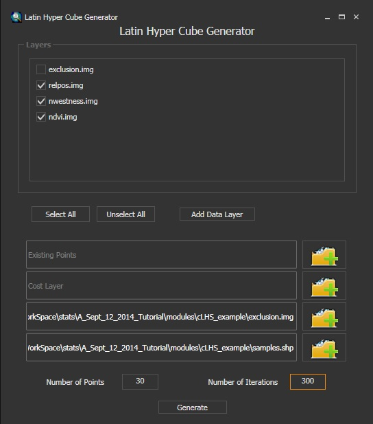
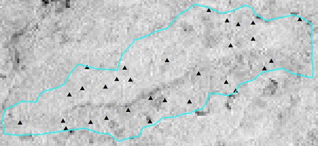
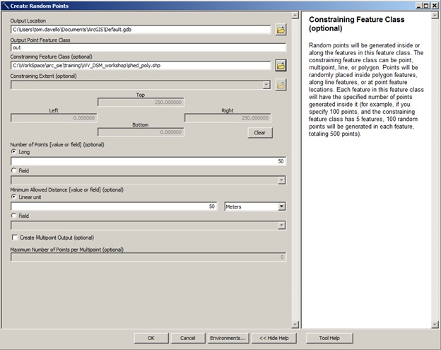
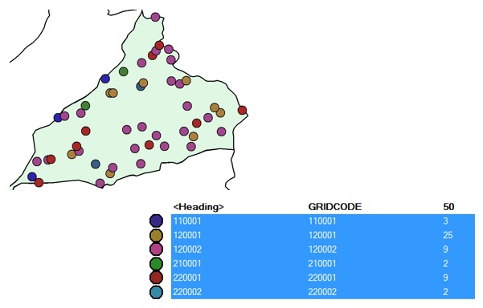

---
html_document:
    keep_md: yes
author: Tom D'Avello, Stephen Roecker, Skye Wills
date: "Monday, February 14, 2016"
output: html_document
title: Chapter 3 - Sampling Design
---


  

# CHAPTER 3: Sampling Design

- [3.1 Introduction](#intro)
- [3.2 Sampling Strategies](#strat) 
    - [3.2.1 Simple random](#simp)
    - [3.2.2 Stratified random](#sr)
    - [3.2.3 Multistage stratified random](#ms)
    - [3.2.4 Systematic](#reg)
    - [3.2.5 Cluster](#cluster)
    - [3.2.6 Conditioned Latin hypercube](#clhs) 
    - [Exercise 1: design a sampling strategy](#ex1)
- [3.3 Other tools for selecting random samples](#tools)
    - [3.3.1 cLHS using TEUI](#teui)
    - [3.3.2 Two-stage stratified random sample design using ArcGIS](#arcgis)
- [3.4 References](#ref)
- [3.5 Additional reading](#add)


## <a id="intro")></a>3.1 Introduction   

Sampling is a fundamental part of statistics. Samples are collected to achieve an understanding of the population, as it is usually not feasible to observe all members of a population. The goal is to collect samples that provide an accurate representation of the population under study. Time and money dictate that the sampling effort be efficient. Highly variable populations will require more samples to characterize their nature.  

**Define your purpose** - are you investigating soil properties, soil classes, plant productivity, etc.?   

**How many samples are needed**  

Because in most cases we're interested in using our field point data to derive inferences, we need enough samples to be confident that they approximate the target population. In the case of calibrating a laboratory device we might only need two measurements, each at opposite ends of the measurement scale. This illustrates the point that the sample size is intimately related the inherent variability in the data. Thus, the number of samples required increases with increasing variability. Also the more samples we have the greater confident level will be able to achieve. For example, sampling at the 85% confidence level will be less intensive than the 95% confidence level.

If we have prior knowledge about the soil attribute we'd like to sample we can estimate the number (n) of samples we'd need to detect a significant difference using a t-test, using either the `power.t.test()`  or `power.prop.tes()` functions. See the fictitious clay example below.


```r
# Clay example. Test to see the number of samples necessary to detect a 3 percent difference in clay between two horizons.
power.t.test(power = 0.95, sd = 2, delta = 16 - 19) # delta = the difference between the two means
```

```
## 
##      Two-sample t test power calculation 
## 
##               n = 12.59872
##           delta = 3
##              sd = 2
##       sig.level = 0.05
##           power = 0.95
##     alternative = two.sided
## 
## NOTE: n is number in *each* group
```

```r
power.t.test(power = 0.95, sd = 3, delta = 16 - 19)
```

```
## 
##      Two-sample t test power calculation 
## 
##               n = 26.98922
##           delta = 3
##              sd = 3
##       sig.level = 0.05
##           power = 0.95
##     alternative = two.sided
## 
## NOTE: n is number in *each* group
```

```r
# Generate a graphical comparison of the fictitious clay example for 2 standard deviations
test1 <- rnorm(1:1000000, mean = 16, sd = 2)
test2 <- rnorm(1:1000000, mean = 19, sd = 2)

summary(c(test1, test2))
```

```
##    Min. 1st Qu.  Median    Mean 3rd Qu.    Max. 
##   6.131  15.740  17.500  17.500  19.260  29.890
```

```r
plot(density(test1), xlim = range(c(test1, test2)), main = "Overlapping Populations", xlab = "Clay %")
lines(density(test2))
abline(v = mean(c(test1, test2)), lty = 2)
```


From the figure above you can see how difficult it is to separate two overlapping populations (e.g. horizons). Also the number of samples required doubles with a 1 unit increase in the standard deviation. This simplistic example though, while enlightening, is hard to implement in practice and for our purposes and only serves as an theoretical exercise. 

Some rules of thumb are as follows:

**Regression models**

- \> 10 observations (n) per predictor (m) (Kutner et al., 2005)
- \> 20 n per m and n > 104 + m to test regression coefficients (Rossiter, 2015; Franklin, 2009)
- never ever use n < 5*m (Rossiter, 2015)


## <a id="strat")></a>3.2 Sampling Strategies
 
### <a id="simp")></a>3.2.1 Simple random 

In simple random sampling, all samples within the region have an equal chance of being selected. A simple random selection of points can be made using either the `spsample()` function within the sp R package, or the Create Random Points tool in ArcGIS.

**Advantages**

 - Simplicity  
 - Requires little prior knowledge of the population    
       
**Disadvantages**

 - Lower accuracy                       
 - Higher Cost
 - Lower efficiency
 - Samples may be clustered spatially
 - Samples may not be representative of the feature attribute(s)  


```r
# load sp package
library(sp)

# Create a sixteen square polygon
grd <- GridTopology(c(1, 1), c(1, 1), c(4, 4))
polys <- as.SpatialPolygons.GridTopology(grd)
plot(polys, main = "Simple random sample")

# Generate simple random sample
test <- spsample(polys, n = 16, type = "random")
points(test)
```


### <a id="sr")></a>3.2.2 Stratified random

In stratified random sampling, the sampling region is spatially subset into different strata, and random sampling is applied to each strata. If prior information is available about the study area it can be used to develop the strata. Strata may be sampled equally or in proportion to area, however if the target or interest is rare in the population it maybe preferable to sample the strata equally (Franklin, 2009).

**Advantages**

 - Higher accuracy
 - Lower cost 

**Disadvantages**

 - Existing knowledge used to construct strata maybe flawed


```r
plot(polys, main = "Stratified random sample")

# Generate stratified random sample
test <- spsample(polys, n = 16, type = "stratified")
points(test)
```


### <a id="ms")></a>3.2.3 Multistage stratified random

In multistage random sampling, the region is separated into different subsets that are randomly selected (i.e. first stage), and then the selected subsets are randomly sampled (i.e second stage). This is similar to stratified random sampling, except that with stratified random sampling each strata is sampled.

**Advantages**

 - Greater efficiency
 - Lower cost  

**Disadvantages**

 - Lower precision
 - stronger clustering than simple random sampling


```r
plot(polys, main = "Two-stage random")

# Select 8 samples from each square
s <- sapply(slot(polys, 'polygons'), function(x) spsample(x, n = 8, type = "random"))
points(sample(s, 1)[[1]]) # randomly select 1 square and plot
points(sample(s, 1)[[1]]) # randomly select 1 square and plot
```


### <a id="reg")></a>3.2.4 Systematic

In systematic sampling, a sample is taken according to a regularized pattern. This approach insures even spatial coverage. Patterns may be rectilinear, triangular or hexagonal. This sampling strategy can be a problem if the variation of the population is cyclical.  

**Advantages**

 - Greater efficiency
 - Lower cost

**Disadvantages**

 - Lower precision


```r
plot(polys, main = "Systematic sample")

# Generate systematic random sample
test <- spsample(polys, n = 16, type = "regular")
points(test)
```


### <a id="cluster")></a>3.2.5 Cluster

In cluster sampling, a cluster or group of points is selected at 1 or several sites. The transect is a example of this strategy, although others shapes are possible(e.g. square, triangle or cross shapes). It is common to orient the transect in direction of greatest variability.

**Advantages**

 - Greater efficiency
 - Lower cost   
 
**Disadvantages**

 - Lower precision  


```r
plot(polys, main = "Clustered (n = 3) random sample")

# Generate cluster random sample
test <- spsample(polys, n = 16, type = "clustered", nclusters = 3)
points(test)
```


### <a id="clhs")></a> 3.2.5 Conditioned Latin hypercube (cLHS)

Conditioned Latin hypercube sampling is a stratified random sampling technique that strives to obtain representative samples from feature (attribute) space (Minasny and McBratney, 2006). For example, assume you have prior knowledge of a study area, have the time and resources to collect 120 points and know the following variables (strata), represented as coregistered raster datasets, to be of importance to the soil property or class being investigated:  

 - Normalized Difference Vegetation Index (NDVI)  
 - Topographic Wetness Index (aka, Wetness Index, Compound topographic index)  
 - Solar insolation (Potential incoming solar radiation)  
 - Relative elevation (aka relative position, normalized slope height)  
 
The cLHS procedure will iteratively select samples from the strata variables such that they replicate the range of values from each stratum. Obtaining a sample that is representative of the feature space becomes increasingly difficult as the number of variables (strata) increase, unless one employs a technique such as cLHS.

To perform cLHS using R we can use the clhs package (Roudier, 2011).


```r
library(clhs)
library(raster)

data(volcano) # http://geomorphometry.org/content/volcano-maungawhau
volcano_r <- raster(as.matrix(volcano[87:1, 61:1]), crs = CRS("+init=epsg:27200"), xmn = 2667405, xmx = 2667405 + 61*10, ymn = 6478705, ymx = 6478705 + 87*10)
names(volcano_r) <- "elev"
slope_r <- terrain(volcano_r, opt = "slope", unit = "radians")

rs <- stack(volcano_r, slope_r)

s <- clhs(rs, size = 20, progress = FALSE, simple = FALSE)

plot(volcano_r)
points(s$sampled_data)
```


```r
# Summary of clhs object
summary(s$sampled_data)
```

```
## Object of class SpatialPointsDataFrame
## Coordinates:
##       min     max
## x 2667460 2667960
## y 6478800 6479520
## Is projected: TRUE 
## proj4string :
## [+init=epsg:27200 +proj=nzmg +lat_0=-41 +lon_0=173 +x_0=2510000
## +y_0=6023150 +datum=nzgd49 +units=m +no_defs +ellps=intl
## +towgs84=59.47,-5.04,187.44,0.47,-0.1,1.024,-4.5993]
## Number of points: 20
## Data attributes:
##       elev           slope       
##  Min.   : 96.0   Min.   :0.0000  
##  1st Qu.:109.2   1st Qu.:0.1224  
##  Median :125.0   Median :0.2443  
##  Mean   :130.9   Mean   :0.2575  
##  3rd Qu.:147.5   3rd Qu.:0.3751  
##  Max.   :186.0   Max.   :0.5697
```

```r
# Summary of raster objects
cbind(summary(volcano_r), summary(slope_r))
```

```
##         elev       slope
## Min.      94   0.0000000
## 1st Qu.  108   0.1231178
## Median   124   0.2461519
## 3rd Qu.  150   0.3781388
## Max.     195   0.7510583
## NA's       0 292.0000000
```

While the above example works well on our small volcano dataset, the clhs package is inefficient when working with large raster datasets. To overcome this limitation we can first take a large random sample and then subsample it using cLHS.


```r
sub_s <- sampleRandom(volcano_r, size = 200, sp = TRUE) # random sample function from the raster package

s <- clhs(sub_s, size = 20, progress = FALSE, simple = FALSE)

plot(volcano_r)
points(s$sampled_data)
```


## Insert section comparing back to back histograms


### <a id="ex1")></a> Exercise 1: design a sampling strategy

- 


## <a id="tools")></a>3.3 Other tools for selecting random features  

An ArcGIS tool is available for selecting random features from the [Job Aids page](http://www.nrcs.usda.gov/wps/PA_NRCSConsumption/download?cid=stelprdb1258054&ext=pdf). This tool will randomly select the specified number of features from a dataset or set of selected features in ArcGIS. It would be an ideal tool for the first stage of a two stage random sample.  

### <a id="teui")></a>3.3.1 cLHS using TEUI  

The TEUI toolkit includes a tools for generating cLHS samples, based on the clhs R package (Roudier, 2011), but modified to work on large raster datasets.

 - Relative Elevation (aka relative position)  
 - Northwestness  
 - Normalized Difference Vegetation Difference (aka NDVI)  
 


Open ArcGIS and add the TEUI Toolkit Toolbar by selecting the Customize > Toolbars and checking TEUI  

  

The TEUI Toolbar looks like this  

  

Open the Latin Hyper Cube Generator Tool  

  

  

The Tool requires that all raster data is in Imagine format (img extension) and share a common projection and resolution. 

The tool adds all raster layers in the Table of Contents to the Layers section. The layers to be used are checked.  

An exclusion layer will be used in this example. An exclusion layer is a binary raster with values of 0/1. Using an exclusion layer confines the selection of points to those areas with a raster value of 1.  

The output file will be a shapefile named samples.shp, and the Number of Points will be 30.  

The number of iterations has been increased from the default of 100 to 300. Increasing the number of iterations increases the processing time, but also increases the likelihood that the samples selected are representative of the selected strata.  

Click on Generate and let the routine process. This could take from several minutes to several hours depending on how large the area is in terms of columns and rows and how many layers are used.  

The resulting output shows 30 points confined to the watershed of interest:  

  

Comparing the frequency distribution of the samples to the population shows a reasonable representation, especially considering the small sample size.  

 


### <a id="arcgis")></a>3.3.2 Two-stage stratified random sample design using ArcGIS

Purpose - Investigators in the Monongahela National Forest were interested in quantifying the depth of organic surface horizons in soils correlated to the Mandy soil series  that formed under red spruce canopy on back slopes in the Upper Greenbrier Watershed (HUC 8 -05050003).  

Stage 1 - randomly selected sub-watersheds in the study area  
 
  

Strata - Sampling based on three stratum:  

 - Mandy soil map units (MfE, MfF, MfG and other)
 - Red Spruce canopy cover (>30% canopy, other)
 - Slope (<= 35%, >= 35%)  
 
Data layers - Input layers include coregistered raster data of each stratum, reclassed as follows:  

  

Raster Calculator is used to add data layers together:  

  

The resulting raster file has the following combinations:  

  

A guide to verify the selection of sample numbers allocated according to the proportionate extent of the strata:  

  

Create Random points within each sub-watershed:  
Open the Create Random Points tool in the Data Management -> Feature Class Toolbox  

  

The sub-watershed layer is specified as the Constraining Feature Class, with 50 points selected  

  

The resulting point file has 50 points per polygon  

  

A check to see if the sample points adequately represent the proportionate extent of the data is made by summarizing the GRIDCODE of the points:  

  

The results compare well to the extent of the population:  


## <a id="ref")></a>3.4 References

Franklin, J., & Miller, J. A. (2009). Mapping species distributions: Spatial inference and prediction. Cambridge: Cambridge University Press. [http://www.cambridge.org/us/academic/subjects/life-sciences/ecology-and-conservation/mapping-species-distributions-spatial-inference-and-prediction](http://www.cambridge.org/us/academic/subjects/life-sciences/ecology-and-conservation/mapping-species-distributions-spatial-inference-and-prediction)

Kutner, M. H., Nachtsheim, C. J., Neter, J., Li, W. (Eds.), 2005. Applied Linear Statistical Models, 5th Edition. McGraw-Hill, p. 1396.

Roudier, P., 2011. clhs: a R package for conditioned Latin hypercube sampling. [https://cran.r-project.org/web/packages/clhs/index.html](https://cran.r-project.org/web/packages/clhs/index.html)

Rossiter, D., 2005. Spatial Modelling and Analysis applied to agronomic and environmental systems [Lecture notes]. Retrieved from [http://www.css.cornell.edu/faculty/dgr2/teach/CSS6200.html](http://www.css.cornell.edu/faculty/dgr2/teach/CSS6200.html)

Minasny, B., & McBratney, A. B. 2006. A conditioned Latin hypercube method for sampling in the presence of ancillary information. Computers & Geosciences, 32(9), 1378-1388. [http://www.sciencedirect.com/science/article/pii/S009830040500292X](http://www.sciencedirect.com/science/article/pii/S009830040500292X)  

Vaughan, R., & Megown, K., 2015. The Terrestrial Ecological Unit Inventory (TEUI) Geospatial Toolkit: user guide v5.2. RSAC-10117-MAN1. Salt Lake City, UT: U.S. Department of Agriculture, Forest Service, Remote Sensing Applications Center. 40 p. [http://www.fs.fed.us/eng/rsac/programs/teui/about.html](http://www.fs.fed.us/eng/rsac/programs/teui/about.html)


## <a id="add")></a>3.5 Additional reading

de Gruijter, J., Brus, D. J., Bierkens, M. F. P., & Knotters, M. (2006). Sampling for Natural Resource Monitoring: Springer. [http://www.springer.com/us/book/9783540224860](http://www.springer.com/us/book/9783540224860)

Schreuder, H.T., R. Ernst, H. Ramirez-Maldonado, 2004. Statistical techniques for sampling and monitoring natural resources. Gen. Tech. Rep. RMRS-GTR-126. Fort Collins, CO: U.S. Department of Agriculture, Forest Service, Rocky Mountain Research Station. 111 p. [http://www.fs.fed.us/rm/pubs/rmrs_gtr126.html](http://www.fs.fed.us/rm/pubs/rmrs_gtr126.html)

U.S. Environmental Protection Agency. (2002). Guidance for choosing a
sampling design for environmental data collection. Washington, DC: US EPA. [http://www.epa.gov/quality/guidance-choosing-sampling-design-environmental-data-collection-use-developing-quality](http://www.epa.gov/quality/guidance-choosing-sampling-design-environmental-data-collection-use-developing-quality)
