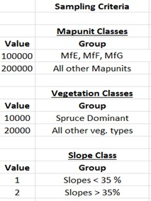
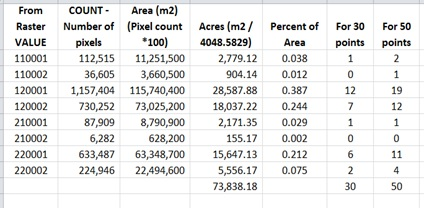
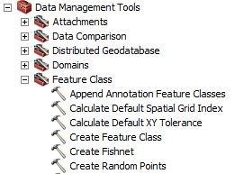
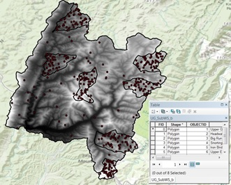

# Chapter 3 - Sampling Design
Tom D'Avello, Stephen Roecker, Skye Wills  
`r Sys.Date()`  


  

# CHAPTER 3: Sampling Design

- [3.0 Introduction](#intro)
- [3.1 Sampling Strategies](#strat) 
    - [3.1.1 Simple Random](#simp)
    - [3.1.2 Stratified Random](#sr)
    - [3.1.3 Multistage Stratified Random](#ms)
    - [3.1.4 Systematic](#reg)
    - [3.1.5 Cluster](#cluster)
    - [3.1.6 Conditioned Latin Hypercube](#clhs) 
- [3.2 Evaluating a Sampling Strategy](#eval)
    - [3.2.1 Exercise: Design a Sampling Strategy](#ex1)
- [3.3 Other Tools for Selecting Random Features](#tools)
    - [3.3.1 cLHS Using TEUI](#teui)
    - [3.3.2 Two-Stage Stratified Random Sample Design Using ArcGIS](#arcgis)
- [3.4 References](#ref)
- [3.5 Additional Reading](#add)


## <a id="intro")></a>3.0 Introduction   

Sampling is a fundamental part of statistics. Samples are collected to achieve an understanding of a population because it is typically not feasible to observe all members of the population. The goal is to collect samples that provide an accurate representation of the population. Constraints on time and money dictate that the sampling effort must be efficient. More samples are needed to characterize the nature of highly variable populations than less variable populations.  

**Define your purpose:** What are you investigating? Examples include soil properties, soil classes, and plant productivity.   

**How many samples are needed?**  

Because you are typically interested in using field point data to derive inferences, you need enough samples to be confident that they approximate the target population. In the case of calibrating a laboratory device, you might only need two measurements, each at opposite ends of the measurement scale. This illustrates the point that sample size is closely related to the inherent variability in the data. The number of samples required increases with increasing variability. Also, the more samples you have, the greater the confidence level you can achieve. For example, sampling at an 85 percent confidence level is less intensive than sampling at a 95 percent confidence level.

If you have prior knowledge about the soil attribute being sampled, you can use a t-test to estimate the number (n) of samples needed to detect a significant difference. You can use either the `power.t.test()` or `power.prop.tes()` functions. See the following example of differences in clay content.


```r
# Clay example. Test to see the number of samples necessary to detect a 3 percent difference in clay between two horizons.
power.t.test(power = 0.95, sd = 2, delta = 16 - 19) # delta = the difference between the two means
```

```
## 
##      Two-sample t test power calculation 
## 
##               n = 12.59872
##           delta = 3
##              sd = 2
##       sig.level = 0.05
##           power = 0.95
##     alternative = two.sided
## 
## NOTE: n is number in *each* group
```

```r
power.t.test(power = 0.95, sd = 3, delta = 16 - 19)
```

```
## 
##      Two-sample t test power calculation 
## 
##               n = 26.98922
##           delta = 3
##              sd = 3
##       sig.level = 0.05
##           power = 0.95
##     alternative = two.sided
## 
## NOTE: n is number in *each* group
```

```r
# Generate a graphical comparison of a fictitious clay example with 2 standard deviations
x1 <- seq(12, 20, 0.1)
y1 <- dnorm(x1, mean = 16, sd = 2)

x2 <- seq(15, 23, 0.1)
y2 <- dnorm(x2, mean = 19, sd = 2)

summary(c(x1, x2))
```

```
##    Min. 1st Qu.  Median    Mean 3rd Qu.    Max. 
##    12.0    15.5    17.5    17.5    19.5    23.0
```

```r
plot(x1, y1, type = "l", xlim = range(c(x1, x2)), 
     main = "Overlapping Populations", 
     xlab = "Clay %"
     )
lines(x2, y2)
abline(v = mean(c(x1, x2)), lty = 2)
```

<!-- -->

From the figure above, you can see how difficult it is to separate two overlapping populations (e.g., horizons). Also, a 1-unit increase in the standard deviation doubles the number of samples required. This simplistic example, although enlightening, is hard to implement in practice and serves only as a theoretical exercise. 

Some rules of thumb for regression models are as follows:

- Use \> 10 observations (n) per predictor (m) (Kutner et al., 2005).
- Use \> 20 n per m and n > 104 + m to test regression coefficients (Rossiter, 2015; Franklin and Miller, 2009).
- Never use n < 5*m (Rossiter, 2015).


## <a id="strat")></a>3.1 Sampling Strategies
 
### <a id="simp")></a>3.1.1 Simple Random 

In simple random sampling, all samples within the region have an equal chance of being selected. A simple random selection of points can be made using either the `spsample()` function within the sp R package or the Create Random Points tool in ArcGIS.

**Advantages**

 - Simplicity  
 - Requires little prior knowledge of the population    
       
**Disadvantages**

 - Lower accuracy  
 - Higher cost
 - Lower efficiency
 - Samples may be clustered spatially
 - Samples may not be representative of the feature attribute(s)  


```r
# load sp package
library(sp)

# Create a sixteen square polygon
grd <- GridTopology(c(1, 1), c(1, 1), c(4, 4))
polys <- as.SpatialPolygons.GridTopology(grd)
plot(polys, main = "Simple random sample")

# Generate simple random sample
test <- spsample(polys, n = 16, type = "random")
points(test)
```

<!-- -->


### <a id="sr")></a>3.1.2 Stratified Random

In stratified random sampling, the sampling region is spatially subset into different strata, and random sampling is applied to each strata. If prior information is available about the study area, it can be used to develop the strata. Strata may be sampled equally or in proportion to area; however, if the target of interest is rare in the population, it may be preferable to sample the strata equally (Franklin and Miller, 2009).

**Advantages**

 - Higher accuracy
 - Lower cost 

**Disadvantages**

 - The existing knowledge used to construct strata may be flawed.


```r
plot(polys, main = "Stratified random sample")

# Generate a spatially stratified random sample
test <- spsample(polys, n = 16, type = "stratified")
points(test)
```

<!-- -->

Note that the `spsample()` function only stratifies the points spatially. Other more sophisticated designs can be implemented using the spsurvey, spcosa, or clhs packages.


### <a id="ms")></a>3.1.3 Multistage Stratified Random

In multistage random sampling, the region is separated into different subsets that are randomly selected (i.e., first stage), and then the selected subsets are randomly sampled (i.e., second stage). This is similar to stratified random sampling, except that with stratified random sampling each strata is sampled.

**Advantages**

 - Greater efficiency
 - Lower cost  

**Disadvantages**

 - Lower precision
 - Stronger clustering than simple random sampling


```r
plot(polys, main = "Two-stage random")

# Select 8 samples from each square
s <- sapply(slot(polys, 'polygons'), function(x) spsample(x, n = 8, type = "random"))
points(sample(s, 1)[[1]]) # randomly select 1 square and plot
points(sample(s, 1)[[1]]) # randomly select 1 square and plot
```

<!-- -->


### <a id="reg")></a>3.1.4 Systematic

In systematic sampling, a sample is taken according to a regularized pattern. This approach ensures even spatial coverage. Patterns may be rectilinear, triangular, or hexagonal. This sampling strategy can be inaccurate if the variation in the population doesn't coincide with the regular pattern (e.g., if the population exhibits periodicity).

**Advantages**

 - Greater efficiency
 - Lower cost

**Disadvantages**

 - Lower precision


```r
plot(polys, main = "Systematic sample")

# Generate systematic random sample
test <- spsample(polys, n = 16, type = "regular")
points(test)
```

<!-- -->


### <a id="cluster")></a>3.1.5 Cluster

In cluster sampling, a cluster or group of points is selected at one or more sites. The transect is an example of this strategy, although other shapes are possible (e.g., square, triangle, or cross shapes). It is common to orient the transect in the direction of greatest variability.

**Advantages**

 - Greater efficiency
 - Lower cost   
 
**Disadvantages**

 - Lower precision  


```r
plot(polys, main = "Clustered (n = 3) random sample")

# Generate cluster random sample
test <- spsample(polys, n = 16, type = "clustered", nclusters = 3)
points(test)
```

<!-- -->


### <a id="clhs")></a> 3.1.6 Conditioned Latin Hypercube (cLHS)

Conditioned Latin hypercube sampling is a stratified random sampling technique to obtain representative samples from feature (attribute) space (Minasny and McBratney, 2006). For example, assume you have prior knowledge of a study area and have the time and resources to collect 120 points. You also know the following variables (strata), which are represented as coregistered raster datasets, to be of importance to the soil property or class being investigated:  

 - Normalized Difference Vegetation Index (NDVI),  
 - Topographic Wetness Index (a.k.a. Wetness Index, compound topographic index),  
 - Solar insolation (potential incoming solar radiation), and
 - Relative elevation (a.k.a. relative position, normalized slope height).
 
The cLHS procedure iteratively selects samples from the strata variables such that they replicate the range of values from each stratum. Without a technique such as cLHS, obtaining a sample that is representative of the feature space becomes increasingly difficult as the number of variables (strata) increases.

To perform cLHS using R, you can use the clhs package (Roudier, 2011).


```r
library(clhs)
library(raster)

# import volcano DEM, details at http://geomorphometry.org/content/volcano-maungawhau
data(volcano)
volcano_r <- raster(as.matrix(volcano[87:1, 61:1]), crs = CRS("+init=epsg:27200"), xmn = 2667405, xmx = 2667405 + 61*10, ymn = 6478705, ymx = 6478705 + 87*10)
names(volcano_r) <- "elev"

# calculate slope from the DEM
slope_r <- terrain(volcano_r, opt = "slope", unit = "degrees")

# Stack Elevation and Slope
rs <- stack(volcano_r, slope_r)

# generate cLHS design
cs <- clhs(rs, size = 20, progress = FALSE, simple = FALSE)

# Plot cLHS Samples
plot(volcano_r)
points(cs$sampled_data)
```

<!-- -->

```r
# Summary of clhs object
summary(cs$sampled_data)$data
```

```
##       elev           slope       
##  Min.   : 96.0   Min.   : 0.000  
##  1st Qu.:108.5   1st Qu.: 8.131  
##  Median :125.0   Median :14.278  
##  Mean   :130.2   Mean   :15.442  
##  3rd Qu.:147.2   3rd Qu.:22.243  
##  Max.   :180.0   Max.   :36.055  
##                  NA's   :2
```

```r
# Summary of raster objects
cbind(summary(volcano_r), summary(slope_r))
```

```
##         elev      slope
## Min.      94   0.000000
## 1st Qu.  108   7.054131
## Median   124  14.103463
## 3rd Qu.  150  21.665758
## Max.     195  43.032469
## NA's       0 292.000000
```

Although the above example works well on our small volcano dataset, the clhs package is inefficient if you are working with large raster datasets. To overcome this limitation, you can first take a large random sample and then subsample it using cLHS.


```r
sub_s <- sampleRandom(volcano_r, size = 200, sp = TRUE) # random sample function from the raster package

# s <- clhs(sub_s, size = 20, progress = FALSE, simple = FALSE)
```


## <a id="eval")></a> 3.2 Evaluating a Sampling Strategy

To gauge the representativeness of a sampling strategy, you can compare the results it produces to the results for other variables you think might coincide with the soil properties or classes of interest. Examples include slope gradient, slope aspect, and vegetative cover. These other variables may be used to stratify the sampling design or to assess the representativeness of our existing samples (e.g., NASIS pedons).

The simple example below demonstrates how to compare several sampling strategies by evaluating how well they replicate the distribution of elevation. 


```r
# create a polygon from the spatial extent of the volcano dataset
test <- as(extent(volcano_r), "SpatialPolygons")

# take a large random sample
sr400 <- spsample(test, n = 400, type = "random")

# take a small random sample
sr <- spsample(test, n = 20, type = "random")

# take a small stratified random sample
str <- spsample(test, n = 23, type = "stratified", iter = 1000)[1:20]

# take a cLHS sample
# cs <- clhs(rs, size = 20, progress = FALSE, simple = FALSE)

# Combind and Extract Samples
s <- rbind(data.frame(method = "Simple Random 400", extract(rs, sr400)),
           data.frame(method = "Simple Random", extract(rs, sr)),
           data.frame(method = "Stratified Random", extract(rs, str)),
           data.frame(method = "cLHS", cs$sampled_data@data)
           )

# Summarize the sample values
aggregate(slope ~ method, data = s, function(x) round(summary(x * 100)))
```

```
##              method slope.Min. slope.1st Qu. slope.Median slope.Mean
## 1 Simple Random 400          0           694         1380       1475
## 2     Simple Random        286           996         1594       1431
## 3 Stratified Random        226           929         1857       1705
## 4              cLHS          0           813         1428       1544
##   slope.3rd Qu. slope.Max.
## 1          2123       4187
## 2          1849       2794
## 3          2315       3334
## 4          2224       3606
```

```r
# Plot overlapping density plots to compare the distributions between the large and small samples
ggplot(s, aes(x = slope, col = method)) + geom_density(cex = 2)
```

<!-- -->

```r
# plot the spatial locations            
par(mfrow = c(1, 3))
plot(volcano_r, main = "Simple random", cex.main = 2)
points(sr, pch = 3, cex = 1.2)

plot(volcano_r, main = "Stratified random", cex.main = 2)
points(str, pch = 3, cex = 1.2)

plot(volcano_r, main = "cLHS", cex.main = 2)
points(cs$sampled_data, pch = 3, cex = 1.2)
```

<!-- -->

```r
dev.off()
```

```
## null device 
##           1
```

The back-to-back histogram figures above illustrate the differences between large and small sets of samples using several sampling designs. Clearly the cLHS approach best duplicates the distribution of elevation (because elevation is explicitly used in the stratification process). The contrast is less severe in the summary metrics, but again cLHS more closely resembles the larger sample. Other comparisons are possible using the approaches in the following chapters.


### <a id="ex1")></a> 3.2.1 Exercise: Design a Sampling Strategy

- Using the "tahoe\_lidar\_highesthit.tif" dataset in the gdalUtils package or using your own dataset (highly encouraged), compare two or more sampling approaches.
- Show your work and submit the results to your coach.


## <a id="tools")></a> 3.3 Other Tools for Selecting Random Features  

An ArcGIS tool for selecting random features is available from the [Job Aids page](http://www.nrcs.usda.gov/wps/PA_NRCSConsumption/download?cid=stelprdb1258054&ext=pdf). This tool randomly selects the specified number of features from a dataset or set of selected features in ArcGIS. It is an ideal tool for the first stage of a two-stage random sample.  


### <a id="teui")></a> 3.3.1 cLHS Using TEUI  

The TEUI toolkit includes a tool for generating cLHS samples on large raster datasets. The tool is based on the clhs R package (Roudier, 2011).

 - Relative Elevation (a.k.a. relative position)  
 - Northwestness  
 - Normalized Difference Vegetation Difference (a.k.a. NDVI)  
 


Open ArcGIS. Add the TEUI Toolkit Toolbar by clicking the **Customize** tab, pointing to **Toolbars**, and checking **TEUI**.  

  

The TEUI Toolbar looks like the following.  

  

Click the **Cube icon** to open the Latin Hyper Cube Generator Tool.

  

  

The Tool requires that all raster data be in Imagine format (i.e., have the "img" extension) and share a common projection and resolution. 

The tool adds all raster layers in the Table of Contents to the Layers section. The layers to be used are checked.  

An exclusion layer is used in this example. An exclusion layer is a binary raster with values of 0 and 1. Using an exclusion layer confines the selection of points to those areas with a raster value of 1.  

The output file is a shapefile named "samples.shp." The Number of Points is 30. The Number of Iterations is increased from the default of 100 to 300. Increasing the number of iterations increases the processing time, but it also increases the likelihood that the samples selected are representative of the selected strata.  

Click **Generate** and let the routine process. This can take from several minutes to several hours, depending on how large the area is in terms of columns and rows and how many layers are used.  

The resulting output shows 30 points confined to the watershed of interest.  

  

Comparing the frequency distribution of the samples to the population shows a reasonable representation, especially considering the small sample size.  

 


### <a id="arcgis")></a> 3.3.2 Two-Stage Stratified Random Sample Design Using ArcGIS

The following example examines a sampling design used by investigators in the Monongahela National Forest. They were interested in quantifying the depth of organic surface horizons in soils that correlated to the Mandy soil series and formed under red spruce canopy on backslopes in the Upper Greenbrier Watershed (HUC 8 -05050003).  

Stage 1: Sub-watersheds in the study area were randomly selected. 
 
  

Strata: Sampling was based on three stratum.  

 - Mandy soil map units (MfE, MfF, MfG, and other)
 - Red spruce canopy cover (>30% canopy, other)
 - Slope (<= 35%, >= 35%)  
 
Data layers: Input layers included coregistered raster data of each stratum, reclassed as follows.  

  

The Raster Calculator was used to add data layers together.  

  

The resulting raster file had the following combinations.  

  

The following guide was used to verify the selection of sample numbers allocated according to the proportionate extent of the strata.  

  

The Create Random Points tool was used within each sub-watershed. The tool is in **Data Management Tools** > **Feature Class toolbox**.  

  

The sub-watershed layer was specified as the Constraining Feature Class. The number of points selected was 50.  

  

The resulting point file had 50 points per polygon.  

  

The following image was used to check if the sample points adequately represented the proportionate extent of the data made by summarizing the GRIDCODE of the points.  

  

The results compared well to the extent of the population.  


## <a id="ref")></a> 3.4 References

Franklin, J., and J.A. Miller. 2009. Mapping species distributions: Spatial inference and prediction. Cambridge: Cambridge University Press. [http://www.cambridge.org/us/academic/subjects/life-sciences/ecology-and-conservation/mapping-species-distributions-spatial-inference-and-prediction](http://www.cambridge.org/us/academic/subjects/life-sciences/ecology-and-conservation/mapping-species-distributions-spatial-inference-and-prediction).

Hengl, T. 2006. Finding the right pixel size. Computers & Geosciences. 32(9):1283–1298. [http://www.sciencedirect.com/science/article/pii/S0098300405002657](http://www.sciencedirect.com/science/article/pii/S0098300405002657).

Hengl, T. 2009. A practical guide to geostatistical mapping, 2nd Ed. University of Amsterdam. ISBN 978-90-9024981-0. [http://spatial-analyst.net/book/system/files/Hengl_2009_GEOSTATe2c0w.pdf](http://spatial-analyst.net/book/system/files/Hengl_2009_GEOSTATe2c0w.pdf).

Kutner, M.H., C.J. Nachtsheim, J. Neter, and W. Li (Eds.). 2005. Applied linear statistical models, 5th edition. McGraw-Hill.

Roudier, P. 2011. cLHS: A R package for conditioned Latin hypercube sampling. [https://cran.r-project.org/web/packages/clhs/index.html](https://cran.r-project.org/web/packages/clhs/index.html).

Rossiter, D. 2015. Spatial modelling and analysis applied to agronomic and environmental systems [Lecture notes]. [http://www.css.cornell.edu/faculty/dgr2/teach/CSS6200.html](http://www.css.cornell.edu/faculty/dgr2/teach/CSS6200.html).

Minasny, B., and A.B. McBratney. 2006. A conditioned Latin hypercube method for sampling in the presence of ancillary information. Computers & Geosciences. 32(9):1378–1388. [http://www.sciencedirect.com/science/article/pii/S009830040500292X](http://www.sciencedirect.com/science/article/pii/S009830040500292X).

Vaughan, R., and K. Megown. 2015. The Terrestrial Ecological Unit Inventory (TEUI) Geospatial Toolkit: User guide v5.2. RSAC-10117-MAN1. Salt Lake City, UT: U.S. Department of Agriculture, Forest Service, Remote Sensing Applications Center.  [http://www.fs.fed.us/eng/rsac/programs/teui/about.html](http://www.fs.fed.us/eng/rsac/programs/teui/about.html).


## <a id="add")></a> 3.5 Additional Reading

de Gruijter, J., D.J. Brus, M.F.P. Bierkens, and M. Knotters. 2006. Sampling for natural resource monitoring: Springer. [http://www.springer.com/us/book/9783540224860](http://www.springer.com/us/book/9783540224860).

Schreuder, H.T., R. Ernst, and H. Ramirez-Maldonado. 2004. Statistical techniques for sampling and monitoring natural resources. Gen. Tech. Rep. RMRS-GTR-126. Fort Collins, CO: U.S. Department of Agriculture, Forest Service, Rocky Mountain Research Station. [http://www.fs.fed.us/rm/pubs/rmrs_gtr126.html](http://www.fs.fed.us/rm/pubs/rmrs_gtr126.html).

U.S. Environmental Protection Agency. 2002. Guidance for choosing a sampling design for environmental data collection. Washington, DC: US EPA. [http://www.epa.gov/quality/guidance-choosing-sampling-design-environmental-data-collection-use-developing-quality](http://www.epa.gov/quality/guidance-choosing-sampling-design-environmental-data-collection-use-developing-quality).
