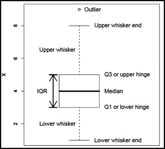
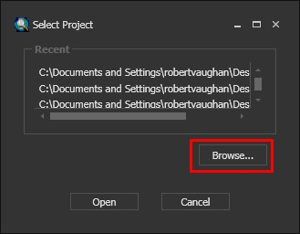
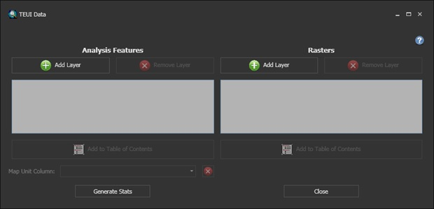
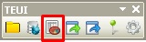
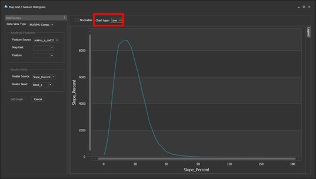
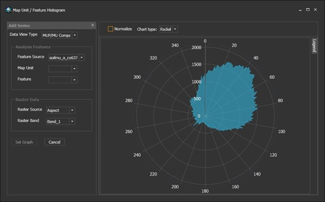
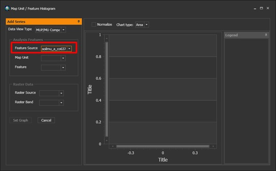
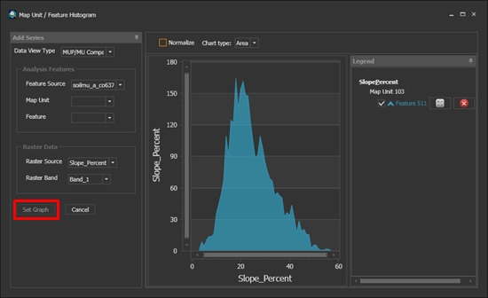
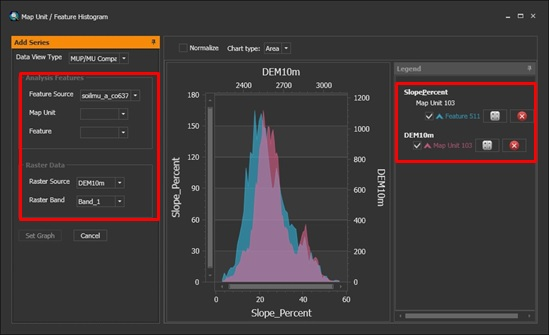

---
title:
author: Tom D'Avello and Stephen Roecker
date: "Friday, February 27, 2015"
output: html_document
html_document:
    keep_md: yes
---
  

# Chapter 4: Exploratory Data Analysis  
 
 - [4.0 Introduction](#intro)  
 - [4.1 Data Inspection](#data)  
     - [4.1.1 Exercise 1: Fetch and Inspect](#ex1)
 - [4.2 Examining Distributions](#dist)
      - [4.2.1 The Normal Distribution](#norm)       
      - [4.2.2 Histograms and Density Curves](#hist) 
      - [4.2.3 Quantile Comparison Plots](#qq)       
 - [4.3 Measures of Central Tendency](#cent)        
 - [4.4 Measures of Dispersion](#disp)      
     - [4.4.1 Box Plots](#box)       
 - [4.5 Measures of Association](#asso)
     - [4.5.1 Correlation Matrix](#cor) 
     - [4.5.2 Scatter Plots](#splom)       
 - [4.6 Transformations](#transform)       	
     - [4.6.1 pH](#ph)       
     - [4.6.2 Slope Aspect and Circular Data](#circular)       
 - [4.7 R Markdown Reports](#rmd)
     - [4.7.1 Exercise 2: Run Pedon_summary_by_taxonname.Rmd](#ex2)
 - [4.8 Zonal Statistics](#zonal)
     - [4.8.1 Zonal Statistics in R](#rtools)
          - [4.8.1.1 Exercise 3: Calculating Zonal Statistics](#ex3)
     - [4.8.2 TEUI Toolkit](#teui)
     - [4.8.3 ArcGIS Tools](#arcgis)
 - [4.9 References](#ref)   
 - [4.10 Additional Reading](#add)

##<a id="intro")></a>4.0 Introduction

Before you embark on developing statistical models and generating predictions, it is essential to understand your data. Such understanding is typically gained using conventional numerical and graphical methods. John Tukey (1977) advocated the practice of exploratory data analysis (EDA) as a critical part of the scientific process.  

Filliben (2004) describes EDA as: 
"...an approach/philosophy for data analysis that employs a variety of techniques (mostly  graphical) to:"

 1. maximize insight into a data set;  
 2. uncover underlying structure;  
 3. extract important variables;  
 4. detect outliers and anomalies;  
 5. test underlying assumptions;  
 6. develop parsimonious models; and  
 7. determine optimal factor settings."  
  
Tukey (1980) summarized:  
"If we need a short suggestion of what exploratory data analysis is, I would suggest that:

 1. It is an attitude, AND  
 2.	A flexibility, AND  
 3.	Some graph paper (or transparencies, or both)."  

"No catalog of techniques can convey a willingness to look for what can be seen, whether or not anticipated. Yet this is at the heart of exploratory data analysis. The graph paper and transparencies are there, not as a technique, but rather as a recognition that the picture examining eye is the best finder we have of the wholly unanticipated."

Fortunately, you can dispense with the graph paper and transparencies and use software that makes routine work of developing the "pictures" (i.e., graphical output) and descriptive statistics needed to explore your data.  

Descriptive statistics include:  

 - **Mean.—**Arithmetic average  
 - **Median.—**Middle value  
 - **Mode.—**Most frequent value  
 - **Standard deviation.—**Variation about the mean  
 - **Interquartile range.—**Range encompassing 50% of the values  
 - **Kurtosis.—**Peakedness of the data distribution  
 - **Skewness.—**Symmetry of the data distribution  

Graphical methods include:  

 - **Histogram.—**A bar plot in which each bar represents the frequency of observations for a given range of values
 - **Density estimation.—**An estimation of the frequency distribution based on the sample data
 - **Quantile-quantile plot.—**A plot of the actual data values against a normal distribution
 - **Box plots.—**A visual representation of median, quartiles, symmetry, skewness, and outliers
 - **Scatter plots.—**A graphical display of one variable plotted on the x axis and another on the y axis
 - **Radial plots.—**Plots formatted for the representation of circular data 


##<a id="data")></a>4.1 Data Inspection

Before you start an EDA, you should inspect your data and correct typos and blatant errors. EDA can then be used to identify additional errors, such as outliers, and to help you determine appropriate statistical analyses. In this chapter, you will use the loafercreek dataset from soil survey area CA630.

```{r, warning=FALSE, message=FALSE}
library(soilDB)
library(lattice)
library(car)

data("loafercreek") # load from the soilDB package

# Generalized the horizon designations
n <- c('A',
       'Bt1',
       'Bt2',
       'Bt3',
       'Cr',
       'R')
# REGEX rules
p <- c('^A$|Ad|Ap',
       'Bt1$',
       '^Bt2$',
       '^Bt3|^Bt4|CBt$|BCt$|2Bt|2CB$|^C$',
       'Cr',
       'R')
loafercreek$genhz <- generalize.hz(loafercreek$hzname, n, p)

h <- horizons(loafercreek) # extract the horizon table
s <- site(loafercreek) # extract the site table
```

As noted in Chapter 1, a visual examination of the raw data is possible by looking at the R object.  

```{r, eval=FALSE}
View(h)

# or by clicking on the dataset in the environment tab
```
 
This view is fine for a small dataset but can be cumbersome for larger ones. The `summary()` function can be used to quickly summarize a dataset. The output, however, can be voluminous even for a small dataset such as this example. Therefore, in the interest of saving space, only a sample of columns will be examined.  

```{r}
vars <- c("genhz", "clay", "total_frags_pct", "phfield", "effervescence")
summary(h[vars])

# or

sub <- subset(h, select = c("genhz", "clay", "total_frags_pct", "phfield", "effervescence"))
summary(sub)
```

The `summary()` function is a generic R function. It returns a preprogrammed summary for any R object. Because `h` is a data frame, you get a summary of each column. Factors are summarized by their frequency (i.e., number of observations); numeric or integer variables print out a five-number summary; and characters simply print their length. The number of missing observations for any variable is also printed. If any of these metrics look unfamiliar, don't worry; they are described shortly.

When you have missing data and the function you want will not run with missing values, the following options are available:  

 1. **Exclude** all rows or columns that contain missing values using the function `na.exclude()`, e.g., `h2 <- na.exclude(h)`. This function, however, can be wasteful because it removes all rows (e.g., horizons), even if the row is missing only 1 value. Instead, it's sometimes best to create a temporary copy of the variable in question and then remove the missing variables, e.g., `clay <- na.exclude(h$clay)`.
 2.	**Replace** missing values with another value, such as zero, a global constant, or the mean or median value for that column, e.g., `h$clay <- ifelse(is.na(h$clay), 0, h$clay) # or h[is.na(h$clay), ] <- 0`.
 3. **Read** the help file for the function you're attempting to use. Many functions have additional arguments for dealing with missing values, e.g., `na.rm`.

A quick check for typos includes examining the list of levels for a factor or character, e.g.:  

```{r}
levels(h$genhz)  # just for factors

unique(h$hzname) # for characters and factors

sort(unique(h$hzname)) # sort the results
```

If the `unique()` function returns typos, such as "BT" or "B t", you can either fix your original dataset or make an adjustment in R, such as:

```{r, eval=FALSE}
h$hzname <- ifelse(h$hzname == "BT", "Bt", h$hzname)

# or

# h$hzname[h$hzname == "BT"] <- "Bt"

# or as a last resort we could manually edit the spreadsheet in R

# edit(h)
```

Typos are common in the old pedon data in NASIS.

### <a id="ex1")></a>4.1.1 Exercise: Fetch and Inspect

- Load the gopheridge dataset from the soilDB package or use your own data (highly encouraged). Inspect the dataset. 
- Apply the generalized horizon rules below or develop your own. See the following [job aid](https://r-forge.r-project.org/scm/viewvc.php/*checkout*/docs/aqp/gen-hz-assignment.html?root=aqp).
- Summarize the depths, genhz, texture class, sand, and fine gravel.
- Show your work and submit the results to your coach.

```{r}
# gopheridge rules
n <- c('A', 'Bt1', 'Bt2', 'Bt3','Cr','R')
p <- c('^A|BA$', 'Bt1|Bw','Bt$|Bt2', 'Bt3|CBt$|BCt','Cr','R')
```

## <a id="dist")></a>4.2 Examining Distributions  

Now that you've checked for missing values and typos and made corrections, you can graphically examine the sample-data distribution of the integer- and numeric-data. Frequency distributions are useful. They can help you visualize the center of your data (e.g., RV) and the spread or dispersion (e.g., low and high). In introductory statistics courses, the normal (i.e., Gaussian) distribution is typically emphasized.

### <a id="norm")></a>4.2.1 The Normal Distribution

What is a normal distribution, and why should you care? Many statistical methods are based on the properties of a normal distribution. However, applying certain methods to data that are not normally distributed can give misleading or incorrect results. Most methods that assume normality are robust enough for all data except the very abnormal. This section is not meant to be a recipe for decision making. It is intended to extend the tools available to examine your data. 

For the parameters most commonly seen by pedologists, the impact of normality is most commonly seen when documenting the ranges of a variable (i.e., low, RV, and high). Commonly, a rule-of thumb, such as "two standard deviations," is used to define the low and high values of a variable. This is fine if the data are normally distributed. If the data are skewed, however, using the standard deviation as a parameter does not provide useful information about the data distribution. The quantitative measures of kurtosis (peakedness) and skewness (symmetry) can be used to assist in accessing normality. Functions for these measures are in the fBasics package, but Webster (2001) cautions against using significance tests for assessing normality. The preceding sections and chapters demonstrate methods to cope with alternative distributions. *Editor's note: Is "preceding" the correct term?*

A Gaussian distribution is often referred to as the "Bell Curve" and has the following properties (Lane, 2016).  

 1. Gaussian distributions are symmetric around their mean. 
 2.	The mean, median, and mode of a Gaussian distribution are equal. 
 3.	The area under the curve is equal to 1.0. 
 4.	Gaussian distributions are denser in the center and less dense in the tails. 
 5.	Gaussian distributions are defined by two parameters: the mean and the standard deviation.
 6.	Sixty-eight percent of the area under the curve is within one standard deviation of the mean.
 7. Approximately 95 percent of the area of a Gaussian distribution is within two standard deviations of the mean.

```{r, echo=FALSE, fig.align="center"}
# http://www.alisonsinclair.ca/2011/03/shading-between-curves-in-r/

r <- rnorm(1:1000000, sd = 2)
d <- density(r)

par(mfrow = c(1, 2))
par(pty = "s")
plot(d, main = "68% highlighted", xlab = "")
q <- quantile(r, prob = c(0.16, 0.84)) 
select <- q[1] <= d$x & d$x <= q[2]
polygon(x = c(q[1], d$x[select], q[2]), y = c(0, d$y[select], 0), col='grey')
abline(v = quantile(r, p = 0.5), lty =2)

plot(d, main = "95% highlighted", xlab = "")
q <- quantile(r, prob = c(0.025, 0.975)) 
select <- q[1] <= d$x & d$x <= q[2]
polygon(x = c(q[1], d$x[select], q[2]), y = c(0, d$y[select], 0), col='grey')
abline(v = quantile(r, p = 0.5), lty = 2)
```
Figure 1.—A normal distribution with 1 standard deviation shaded on the left and 2 standard deviations shaded on the right.  
*Editor's note: Please add a caption. Because this chapter uses some captions, all of the figures should have a caption. Note also that many of the figures do not appear in the RMD file. I don't know if the lack of imagery in the RMD file matters other than making it difficult to predict what the HTML file will look like.*

A histogram or density plot provides a quick visual reference for determining normality as discussed in section 4.1. Distributions are typically normal, bimodal, or skewed.  


Figure 2.—Sample histograms.    

Some distributions are uniform, or nearly so.

```{r, echo = FALSE, warning=FALSE}
test <- data.frame(x = seq(0, 1, by = 0.1), y = rep(1, 11))
plot(test, type = "line", main = "Uniform Distribution: Minimum = 0, Maximum = 1")
```

Figure 3.—A uniform distribution.  


```{r, echo=FALSE, eval=FALSE}
# An idealized normal distribution is shown in Figure 1:

test <- rnorm(1000000)
plot(density(test), main = "Normal Distribution: Mean = 0, Standard Deviation = 1")

# 1. Normal Distribution

# Figure 1 indicates that the data that is symmetrically distributed, such that there is an equal distribution on either side of the highest point on the graph. By contrast, Fig. 2 and 3 are asymmetrical, with a higher distribution of values on the low end and high end of the spectrum respectively.  

test <- rbeta(1000000, shape1 = 2, shape2 = 1000)
plot(density(test), main = "Beta Distribution: Shape 1 = 2, Shape 2 = 1000")

# Figure 2. Example of a positively skewed distribution.  

test <- rbeta(1000000, shape1 = 1000, shape2 = 2)
plot(density(test), main = "Beta Distribution: Shape 1 = 1000, Shape 2 = 2")

# Figure 3. Example of a negatively skewed distribution.

# Displaying data in this manner provides a visual means to determine if your data have a wide, flat, narrow, peaked, normal, or skewed distribution.  
```


### <a id="hist")></a>4.2.2 Histograms and Density Curves  

The `histogram()` and `densityplot()` functions plot a histogram and density curve, respectively.  

```{r}
histogram(~ clay + sand + total_frags_pct, data = h, scales = list(relation = "free"))

# or

histogram(~ clay | genhz, data = h) # grouped by genhz

# or individually

# histogram(~ clay, data = h)

# or using the graphics package

# par(mfrow = c(1, 3))
# hist(h$clay, col = "grey")
# hist(h$sand, col = "grey")
# hist(h$total_frags_pct, col = "grey")
# dev.off()
```

Figures 4a and 4b.—Example histograms.  


Because histograms are dependent on the number of bins, they're not the best method for determining the shape of a distribution for small datasets. A density estimation, also known as a Kernel density plot, generally provides a better visualization of the shape of the distribution in comparison to the histogram.  
 
```{r}
histogram(~ clay + sand + total_frags_pct, data = h,
          type = "density",
          panel = function(x, ...) {
            panel.histogram(x, ...)
            panel.densityplot(x, ..., darg = list(na.rm  = TRUE))
            }
          )

densityplot(~ clay + sand + total_frags_pct, data = h, auto.key = TRUE)

# or using the graphics package

# test <- density(h$clay, na.rm = TRUE)
# plot(test) 
```

Figure 5.—A Kernel density plot, which depicts a smoothed line of the distribution.  


In a histogram, the y-axis represents the number or percent (i.e., frequency) of observations. In a density plot, the y-axis represents the probability of observing any given value such that the area under the curve equals one. Notice how the histogram of clay seems to emphasis the long right tail of values, which might call into question the normality of the distribution. One curious feature of the density curve in figure 5 is the hint of a bimodal distribution. Given that the sample includes a mixture of surface and subsurface horizons, you may have two different populations. However, considering how much the two distributions overlap, separating them seems impractical in this instance.


### <a id="qq")></a>4.2.3 Quantile Comparison Plots (QQ plot)  

A QQ plot is a plot of the actual data values against a normal distribution (which has a mean of 0 and a standard deviation of 1).  

A QQ plot of sand content may be made for the sample dataset as: 

```{r}
qqnorm(h$clay, main = "Normal Q-Q Plot for Clay")
qqline(h$clay)

qqnorm(h$total_frags_pct, main = "Normal Q-Q Plot for Rock Fragments")
qqline(h$total_frags_pct)
```

Figures 6a and 6b.—QQ plots.  

The line in figures 6a and 6b represents the quantiles of a normal distribution. If the data set is perfectly normal, the data points fall along the line. Overall, this plot shows the clay in the example to be more-or-less normally distributed. However, the second plot again shows that the rock fragments are far from normally distributed.

A more detailed explanation of QQ plots may be found on Wikipedia:  
[https://en.wikipedia.org/wiki/QQ_plot](https://en.wikipedia.org/wiki/Q%E2%80%93Q_plot). *Editor's note: In general, Wikipedia is not considered a scholarly reference and is not cited. By listing it here, you imply approval of whatever version is online whenever the reader checks. (Let the readers Google QQ plots on their own.) I highly recommend you remove these lines. At the very least, add the date you accessed the site.*  


## <a id="cent")></a>4.3 Measures of Central Tendency  

Measures of central tendency determine the midpoint of the range of observed values. In NASIS, the midpoint should ideally be equivalent to the representative value (RV) for numeric and integer data. The mean and median are the most commonly used measures for soil purposes.

**Mean**

The mean is the arithmetic average that everyone is familiar with. It is formally expressed as:. It sums ( $\sum$ ) all the X values in the sample and divides by the number (n) of samples. All references in this document refer to samples rather than to populations.  

The mean clay content from the loafercreek dataset may be determined as follows:  

```{r}
clay <- na.exclude(h$clay) # first remove missing values and create a new vector

mean(clay)

# or use the additional na.rm argument

mean(h$clay, na.rm = TRUE)
```

To determine the mean by a group or category, use the aggregate command.

```{r}
aggregate(clay ~ genhz, data = h, mean)
```

**Median**

The median is the middle measurement of a sample set. As such, it is a more robust estimate of central tendency than the mean. The median is the middle (50th) quantile, meaning there are an equal number of samples with values less than and greater than the median. For example, assuming there are 21 samples, sorted in ascending order, the median would be the 11th sample.

The median from the sample dataset may be determined as follows:  

```{r}
median(clay)
```

To determine the median by group or category, use the aggregate command again.  

```{r}
aggregate(clay ~ genhz, data = h, median)

# or we could use the summary() function to get both the mean and median

aggregate(clay ~ genhz, data = h, summary)
```

In this example, the mean and median are only slightly different, so you can safely assume that you have a normal distribution. However, many soil variables commonly have a non-normal distribution. For an example, look at the following graphical examination of the mean versus median for clay and rock fragments.  

```{r}
test <- density(clay)
plot(test, main = "Clay")
amean <- mean(clay)
amed <- median(clay)
abline(v = amed, col = "blue") # plot the median as a blue vertical line 
abline(v = amean, col = "orange") # plot the mean as a orange vertical line

frags <- h$total_frags_pct
test <- density(frags)
plot(test, main = "Rock Fragments")
amean <- mean(frags)
amed <- median(frags)
abline(v = amed, col = "blue") # plot the median as a blue vertical line 
abline(v = amean, col = "orange") # plot the mean as a orange vertical line
```

Figures 7a and 7b.—Comparison of the mean and median for clay and rock fragments.  

The blue vertical line in figures 7a and 7b represents the breakpoint for the median, and the orange line represents the mean. The median is a more robust measure of central tendency than the mean. In order for the mean to be a useful measure, the data distribution must be approximately normal. The further the data departs from normality, the less meaningful the mean becomes. The median is independent of the data distribution, i.e., 50% of the samples are below the median and 50% are above. The example in figure 7a for clay indicates that distribution is approximately normal. For the rock fragments in figure 7b, however, you can see a long tailed distribution (e.g., skewed). Using the mean in this instance would overestimate the rock fragments. Although, in this instance, the difference between the mean and median is only `r round(amean - amed)` percent.

**Mode**

The mode is the measurement that occurs most frequently in the sample. The use of mode is typically reserved for factors, which are discussed below. One issue with using the mode for numeric data is that the data need to be rounded to the level of desired precision. In following example, you can see that it looks like someone entered laboratory data as pedon horizon data. It's difficult to determine from the example, but the first column in each sequence shows the values and the following columns show the number occurrences for that value.

```{r}
table(h$clay) # show a frequency table

# we can fix the rounding error like so

# table(round(h$clay))

# or

# table(as.integer(h$clay)) 

sort(table(round(h$clay)), decreasing = TRUE)[1] # sort and select the 1st value, which will be the mode
```

## <a id="disp")></a>4.4 Measures of Dispersion  

Measures of dispersion are used to determine the spread of values around the midpoint. These measures describe the degree to which the samples are spread widely across the range of observations or concentrated near the midpoint. In NASIS, these values might equate to the low (L) and high (H) values for numeric and integer data.


**Variance**  
Variance is a positive value indicating deviation from the mean:.  

This measure is the square of the sum of the deviations from the mean, divided by the number of samples minus 1. It is commonly referred to as the sum of squares. As the deviation increases, the variance increases. Conversely, if there is no deviation, the variance equals 0. As a squared value, variance is always positive. Variance is an important component for many statistical analyses, including the most common measure of dispersion: the *standard deviation.* Variance for the sample dataset is:  

```{r}
var(clay)
```

**Standard Deviation**  
The standard deviation is the square root of the variance:.  

The units of the standard deviation are the same as the units measured. From the formula, you can see that the standard deviation is simply the square root of the variance. Standard deviation for the sample dataset is:  

```{r}
sd(clay)

# or

# sqrt(var(clay))
```

**Coefficient of Variation**  

The coefficient of variation (CV) is a relative (i.e., unitless) measure of standard deviation:. *Editor's note: Please review the image used for the equation. Is it intentional that there are 2 lines separating the numerator and denominator in s//x?* 

CV is calculated by dividing the standard deviation by the mean and multiplying by 100. Because standard deviation varies in magnitude with the value of the mean, the CV is useful for comparing relative variation among different datasets. Webster (2001), however, discourages the use of CV to compare different variables. Webster (2001) also stresses that CV is reserved for variables that have an absolute 0. An example is clay content. CV may be calculated for the sample dataset as the following:  

```{r}
cv <- sd(clay) / mean(clay) * 100
cv
```


**Quantiles (a.k.a. Percentiles)**  

The percentile is the value that cuts off the first nth percent of the data values when sorted in ascending order.

The default for the `quantile()` function returns the  min, 25th percentile, 50th percentile (the median), 75th percentile, and max. These values are the "five number summary" originally proposed by Tukey. Other probabilities, however, can be used. At present, the 5th, 50th, and 95th percentiles are proposed for determining the range in characteristics (RIC) for a given soil property.

```{r}
quantile(clay)

# or

quantile(clay, c(0.05, 0.5, 0.95))
```

For the five number summary, 25% of the observations fall between each of the intervals. Quantiles are a useful metric because they are largely unaffected by the distribution of the data and have a simple interpretation.


**Range**  

The range is the difference between the highest measurement of a group and the lowest. Using the sample data, the minimum and maximum values observed may be determined by the following:  

```{r}
range(clay)
```

The value of the range may be determined by the following:  

```{r}
diff(range(clay))

# or

# max(clay) - min(clay)
```


**Interquartile Range**

The interquartile range (IQR) is the range from the upper (75%) quartile to the lower (25%) quartile. This represents the 50% of observations occurring in the midrange of a sample. IQR is a robust measure of dispersion. It is unaffected by the distribution of data. In soil survey, you could consider the IQR to estimate the central concept of a soil property. IQR may be calculated for the sample dataset as follows:  

```{r}
IQR(clay)

# or

# diff(quantile(clay, c(0.25, 0.75)))
```


### <a id="box")></a>4.4.1 Box Plots  

Box plots are graphical representations of the five number summary, depicting quartiles, minimum, maximum, and outliers (if present). Box plots convey the shape of the data distribution, the presence of extreme values, and the ability to compare with other variables using the same scale. They provide an excellent tool for screening data quality, determining thresholds for variables, and developing working hypotheses.  

The parts of the box plot are shown in figure 8. The "box" of the box plot is the 1st quartile (Q1 in the figure) and the 3rd quartile (Q3 in the figure). The median, or 2nd quartile, is the dark line in the box. The whiskers show data that is 1.5 * IQR above and below the 3rd and 1st quartiles. Any data point that is beyond a whisker is considered an outlier.  

Outliers are not necessarily in error, they are just extreme compared to the rest of the dataset. You may, however, want to evaluate these points to ensure that they are correct.  




Figure 8.—Box plot description (Seltman, 2009).  

A box plot of sand content by horizon may be made for the sample dataset as:  

```{r boxplots}
bwplot(clay ~ genhz, xlab = "Horizon", ylab = "Clay (%)", data = h)

# or using the graphics package

# boxplot(clay ~ genhz, xlab = "Horizon", ylab="Clay (%)", data = h)
```

Figure 9.—Box plot of clay by horizon.  

The xlab and ylab parameters control the titles of the axes.  

The box plot in figure 9 shows a steady increase in clay content with depth. Note the outliers in the box plots. They are identified by the individual circles.

**Frequencies**

To summarize factors and characters, you can examine their frequency or number of observations using the `table()` function.

```{r}
table(h$genhz)

# or

# summary(h$genhz)
```

This function gives you a count of the number of observations for each horizon. If you want to see the comparison between two different factors or characters, you can include two variables.

```{r}
table(h$genhz, h$hzname)

table(h$genhz, h$texture_class)
```

You can also easily add margin totals to the table or convert the table frequencies to proportions.

```{r}
# append the table with row and column sums

addmargins(table(h$genhz, h$texture_class))

# calculate the proportions relative to the rows, margin = 1 calculates for rows, margin = 2 calculates for columns, margin = NULL calculates for total observations

round(prop.table(table(h$genhz, h$texture_class), margin = 1) * 100) 
```


## <a id="asso")></a>4.5 Measures of Association 

### <a id="cor")></a>4.5.1 Correlation Matrix

A correlation matrix is a table of the calculated correlation coefficients of all variables. It provides a quantitative measure to guide  decision making. The following code produces a correlation matrix for the sp4 dataset:  

```{r}
h$hzdepm <- with(h, (hzdepb - hzdept) /2)
vars <- c("hzdepm", "clay", "sand", "total_frags_pct", "phfield")

round(cor(h[vars], use = "complete.obs"), 2)
```

As seen in the output, variables are perfectly correlated with themselves and have a correlation coefficient of 1.0. Negative values indicate a negative relationship between variables. A good rule of thumb is anything with a value of **0.7** or greater is considered highly correlated. 


### <a id="splom")></a>4.5.2 Scatter Plots

Plotting points of one ratio or interval variable against another creates a scatter plot. Plots can be produced for a single or multiple pairs of variables. Many independent variables are often under consideration in soil survey work. This is especially common when GIS is used, which offers the potential to correlate soil attributes with a large variety of raster datasets.  

The purpose of a scatter plot is to see how one variable relates to another. In general, the goal is parsimony (i.e., simplicity). Modeling attempts to determine the fewest number of variables required to explain or describe a relationship. If two variables explain the same thing, i.e., they are highly correlated, only one variable is needed. The scatter plot provides a perfect visual reference for this.

Create a basic scatter plot using the loafercreek dataset.

```{r}
xyplot(clay ~ sand, data = h)

# or

# plot(clay ~ sand, data = h)
```

Figure 10.—A scatter plot.

In figure 10, clay is plotted on the Y axis and pH is plotted on the X axis. Figure 10 shows a weak correlation between these variables.  

The function below produces a scatter plot matrix for all the numeric variables in the dataset. This command is good for determining rough linear correlations for continuous variables.  

```{r}
splom(h[vars])

# or

# pairs(h[vars])
```


## <a id="transform")></a>4.6 Transformations

Slope aspect and pH are two common variables that warrant special consideration for pedologists.  

### <a id="ph")></a>4.6.1 pH

Because pH has a logarithmic distribution, median and quantile ranges are the [preferred](http://www.fao.org/docrep/field/003/AC175E/AC175E07.htm) measures when summarizing pH. Remember, pH 6 and pH 5 correspond to hydrogen ion concentrations of 0.000001 and 0.00001 respectively.  The actual average is 5.26;  -log(0.000001 + 0.00001/2). If no conversions are made for pH, the mean and standard deviation in the summary are considered the geometric mean and standard deviation, not the arithmetic. The higher the pH, the greater the difference between the geometric and arithmetic mean. The difference between the correct average of 5.26 and the incorrect of 5.5 may appear small, but proper handling of data types is still the best practice.

If you have a table with pH values and wish to calculate the arithmetic mean using R, the following code will work:

```{r}
# arithematic mean
-log10(mean(10^-h$phfield, na.rm = TRUE)) 

# geometric mean
mean(h$phfield, na.rm = TRUE) 
```

If there is a need to create a surface of pH values, i.e., to interpolate values from point observations, the operation of determining values at unknown points is analogous to determining an average. The hydrogen ion concentration would be the proper input.  

If spatial interpolation is to be performed, the following steps should be executed:  

 **I. Transform pH to the actual H+ concentration.**  
 **II. Interpolate.**  
 **III. Back transform to log value.**

Following is a brief example for interpolating pH using common software.

**I. Transform pH to the actual H+ concentration**

1. This example uses a comma-delimited text file named "Excel_ph2.csv" with pH and x and y coordinates.
2.	Open the file in Excel. It looks similar to this:  
  
3.  Format a column as numeric with ~15 decimals and a header named H_concentration.
4.	Enter a formula in the first empty cell as: =(1/10^B2) * 1000000.
5.	Drag the cell down to all empty records, which results in a transformed H+ concentration.
    
 
    The following is a workaround for ArcGIS, which truncates data that are extremely small (such as the H+ concentration for pH > 7).  

    Bring the text file into ArcGIS as points using **Make XY Event Layer.**

      

      

    Open the table for the Event layer.  

      

**II. Interpolate**

1. Interpolate using the interpolation method of choice. Spline is used in this example.

      
      

2. The resulting values correspond to H+ concentration * 10<sup>6</sup>.  

      

**III. Back transform to log value**

1. Convert values to pH using **Raster Calculator**.  

      

2. The values now correspond to pH.

      


### <a id="circular")></a>4.6.2 Slope Aspect and Circular Data

The numerical summary of slope aspect requires the use of circular statistics, and graphical interpretation requires circular plots. For example, if a set of soil map units has a uniform distribution of slope aspects ranging from 335 degrees to 25 degrees, the Zonal Statistics tool in ArcGIS would return a mean of 180.  

The most intuitive means for evaluating and describing slope aspect are circular plots, which are available with the circular package in R, and the radial plot option in the [TEUI](http://www.fs.fed.us/eng/rsac/programs/teui/downloads.html) Toolkit. The circular package in R also calculates circular statistics, such as mean, median, quartiles etc.

```{r, warning=FALSE, message=FALSE}
library(circular)

aspect <- s$aspect_field
aspect <- circular(aspect, template="geographic", units="degrees", modulo="2pi")

summary(aspect)
```

The numeric output is fine, but a graphic is more revealing. The following shows the dominant southwest slope aspect.  

```{r}
rose.diag(aspect, bins = 8, col="grey")
```

Figure 11.—A rose diagram.  

## <a id="rmd")></a>4.7 R Markdown Reports (.Rmd)

R Markdown (RMD) is a document format that makes it easy to create reports and other dynamic documents. It allows R code to be mingled with text and executed like an R script. This allows R to generate reports similarly to NASIS. 

Several reports have been developed to generate summaries of pedon and GIS data. Examples can be found at: [https://github.com/ncss-tech/soil-pit/tree/master/examples](https://github.com/ncss-tech/soil-pit/tree/master/examples). Some of the examples show customized reports developed to generate zonal statistics of map units. Instructions can be found at the Soil Survey Region 11 [SharePoint site](https://ems-team.usda.gov/sites/NRCS_SSRA/mo-11/Soils%20%20GIS/Forms/AllItems.aspx?RootFolder=%2Fsites%2FNRCS%5FSSRA%2Fmo%2D11%2FSoils%20%20GIS%2Fguides%2FR&FolderCTID=0x0120007929E36D8FF15644B2C3F1488664C3CD&View=%7BFE55388F%2DFD5F%2D4A7B%2D98BD%2DA1F618066492%7D). Following is a demonstration of how to run an existing RMD file to summarize a series of pedons for a given soil series. *Editor's note: Does it matter that the SharePoint site is only available to NRCS employees?*

**Objectives**

-	Load your NASIS selected set with Pedon and Site tables (both are required).
-	Run the R setup file.
-	Run knitr report.

**Requirements**

-	Data must be properly populated; otherwise, the report may fail. Common examples of improper population include:
    -	Horizon depths don't lineup.
    -	The Pedon and Site tables aren't both loaded.
-	You must be familiar with RStudio. If not, see the Job Aids webpage for an introduction.
-	An ODBC connection to NASIS must be setup. If not, see the Job Aids webpage for instructions.
-	You must have either assigned generalized horizon labels (GHL) to the "Comp_Layer_ID" column within the pedon horizon table within NASIS or setup a GHL using pattern matching. For an introduction to pattern matching, see the Job Aid: [Assigning Generalized Horizon Labels.](https://r-forge.r-project.org/scm/viewvc.php/*checkout*/docs/aqp/gen-hz-assignment.html?root=aqp)

**Instructions**

1. Load your NASIS selected set. Run a query, such as "POINT - Pedon/Site/NCSSlabdata by upedonid and Taxon Name" to load your selected set. Be sure to target both the pedon and site tables. Remove from your selected set any pedons and sites you wish to exclude from the report.
2.	Open RStudio and run the setup file. Copy the box below and paste it into the R console. 

    ```{r, eval=FALSE}
    # Download .Rprofile and setup
    download.file("https://raw.githubusercontent.com/ncss-tech/soil-pit/master/sandbox/stephen/r_setup.R", "C:/workspace/soil-pit/r_setup.R", method = "libcurl")

    # Run R setup file
    source("C:/workspace/soil-pit/r_setup.R")
    ```

    The setup only needs to be run once. Afterwards, you only need to update your R packages intermittently. You can update R by clicking the **Update** button on the **Packages** tab in the lower right window. The first time can be lengthy. 

3. Open the pedon report. Navigate to the file path specified above and open pedon_summary_by_taxonname.Rmd or lab_summary_by_taxonname.Rmd in Rstudio.
 
4. Check or create a genhz_rules file for your soil series. In order to aggregate the pedons by horizon designation, a genhz_rules file (e.g., Genesee_rules.R) is needed. See below.

    

    If Genesee_rules.R does not exist, see the following job aid on how to create one: [Assigning Generalized Horizon Labels](https://r-forge.r-project.org/scm/viewvc.php/*checkout*/docs/aqp/gen-hz-assignment.html?root=aqp).

    

    Pay special attention to how caret "^" and dollar "\$" symbols are used. They function as anti-wildcards. For example, placing "^" before an A horizon (^A) matches any horizon designation that follows A, such as Ap and Ap1. Placing "\$" after a Bt horizon (Bt\$) matches any horizon designation that precedes Bt, such as 2Bt and 3Bt. Encapsulating a horizon with both "^" and "\$" symbols results in only exact matches. For example, ^A$ only matches A, not Ap or A1. *Editor's note: Is the back slash before the dollar sign correct?  If so, should it be in the last sentence also?*

5.	Enter or replace the soil series of interest, and click the **Knit HTML** button. Be sure to encase the name of the soil series in quotations. You can use either double or single quotation marks, e.g., `"series"` or `'series'`.

    

6.	Save the report. When created, the report is automatically saved in the same folder as the R report. However, it is always given the same generic name as the R report (i.e., C:/workspace/soil-pit/reports/pedon_summary_by_taxonname.html), and it will therefore be overwritten the next time the report is run. If you wish to save the report, rename the HTML file or convert it to PDF. Also when reopening the HTML file with Internet Explorer, click **Allow blocked content** if prompted. Otherwise, Internet Explorer may alter the formatting within the document.

**Sample Pedon Report**
 


### <a id="ex2")></a>4.7.1 Exercise 2: Run Pedon\_summary\_by\_taxonname.Rmd

- Load your selected set with the pedon and site table for an existing GHL file, or make your own (highly encouraged).
- Run the pedon_summary_by_taxonname.Rmd report on a soil series of your choice.
- Show your work and submit the results to your coach.


## <a id="zonal")></a>4.8 Zonal Statistics

To summarize spatial data for a polygon, some form of zonal statistics can be used. "Zonal statistics" is a generic term for statistics that aggregate data for an area or zone (e.g., a set of map unit polygons). Two methods are available: census-survey and sample-survey. 

The most common method, which is provided by most GIS, is the census-survey method. This method computes a statistical summary of all the raster cells that overlap a polygon or map unit. This approach is generally faster and provides a complete summary of the spatial data. An alternative approach is the sample-survey method, which takes a collection of random samples from each polygon or map unit. Although the sample approach is generally slower and does not sample every cell that overlaps a polygon, it does offer certain advantages. For example, the census approach typically only provides basic statistics, such as minimum, maximum, mean, standard deviation, and sum. For skewed data sets, however, the mean and standard deviation may be unreliable. A better alternative for skewed data sets is to use nonparametric statistics, such as quantiles. Examples of nonparametric statistics are covered in Chapter 4. The advantage of the sample-survey approach is that it allows you to utilize alternative statistics, such as quantiles, to perform a more thorough exploratory analysis. Some people prefer the census approach because it provides a complete summary of all the data that overlaps a map unit. It is important, however, to remember that all spatial data are only approximations of the physical world and therefore are only estimates with varying levels of precision. *Editor's note: This paragraph states "Examples of nonparametric statistics are covered in Chapter 4." This is Chapter 4. If this is a correct statement, please clarify if you mean all sections of this chapter or specific sections.*

Before you extract spatial data for spatial predictions, the data must meet the following conditions:  

 - All data conform to a common projection and datum.
 - All raster data have a common cell resolution.
 - All raster data are co-registered, that is, the geographic coordinates of cell centers are the same for all layers. Setting the _Snap Raster_ in the ArcGIS Processing Environment prior to the creation of raster derivatives can ensure cell alignment. An ERDAS model is also available to perform this task.  

### <a id="rtools")></a>4.8.1 Zonal Statistics in R

Zonal statistics in R can be implemented using either the census approach or sample approach. Although R can compute zonal statistics using the census approach with the `zonal()` function in the raster package, it is considerably faster to call another GIS via the RSAGA or spgrass6 packages. These additional GIS packages provide R functions to access SAGA and GRASS commands. In the following example, the RSAGA package is used.

```{r r_poly_extract}
# library(rgdal)
# 
# ca794 <- readOGR(dsn = "M:/geodata/soils/CA794/spatial", layer = "soilmu_a_ca794") # import CA794 map unit polygons
# ca794 <- spTransform(ca794, CRS("+init=epsg:5070")) # reproject
# ca794$mukey2 <- as.integer(as.character(ca794$MUKEY)) # convert MUKEY to  an integer
# writeOGR(ca794, dsn = "C:/workspace", layer = "ca794", driver = "ESRI Shapefile", overwrite_layer = TRUE) # export shapefile
# 
# library(RSAGA)
# myenv <- rsaga.env(path = "C:/Program Files/QGIS Wien/apps/saga") # set rsaga path
# ned <- raster("M:/geodata/project_data/8VIC/sdat/ned30m_8VIC.sdat") # load DEM
# test <- raster(extent(ca794), ext = extent(ned), crs = crs(ned), res = res(ned))  # create a blank raster that matches the DEM
# writeRaster(test, file = "M:/geodata/project_data/8VIC/sdat/ca794.sdat", format = "SAGA", progress = "text", overwrite = TRUE) # export the raster
# 
# Convert the CA794 shapefile to a rsaga raster
#
# rsaga.geoprocessor("grid_gridding", 0, env = myenv, list(
#   INPUT = "C:/workspace/ca794.shp",
#   FIELD = "mukey2",
#   OUTPUT = "2",
#   TARGET = "0",
#   GRID_TYPE = "2",
#   USER_GRID = "M:/geodata/project_data/8VIC/sdat/ca794.sgrd",
#   USER_XMIN = extent(test)[1] + 15,
#   USER_XMAX = extent(test)[2] - 15,
#   USER_YMIN = extent(test)[3] + 15,
#   USER_YMAX = extent(test)[4] - 15,
#   USER_SIZE = res(test)[1]
# )
# )
# 
# Extract the zonal statistics for 2 rasters
#
# rsaga.geoprocessor("statistics_grid", 5, env = myenv, list(
#   ZONES = "M:/geodata/project_data/8VIC/sdat/ca794.sgrd",
#   STATLIST = paste(c("M:/geodata/project_data/8VIC/sdat/ned30m_8VIC.sgrd", "M:/geodata/project_data/8VIC/sdat/ned30m_8VIC_slope5.sgrd"), collapse = ";"),
#   OUTTAB = "C:/workspace/test.csv"
# ))

test <- read.csv("C:/workspace/test.csv") # import the results
names(test)[1] <- "mukey" # rename the mukey column
test[test$mukey == 2480977, ] # examine mukey 2480977
```

To implement the sample approach to zonal statistics, you can use the `extract()` and `over()` functions in the raster and sp packages respectively.

```{r}
# s <- spsample(ca794, n = 100000, type = "stratified") # take a stratified random sample
# 
# setwd("M:/geodata/project_data/8VIC/")
# 
# rs <- stack(c(elev = "ned30m_8VIC.tif", slope = "ned30m_8VIC_slope5.tif")) # create a raster stack
# proj4string(rs) <- CRS("+init=epsg:5070") # set the spatial projection
# 
# 
# test1 <- over(s, ca794) # extract the map unit polygon values
# test2 <- data.frame(extract(rs, s)) # extract the raster values
# test2 <- cbind(test1, test2) # combine the two datasets
# save(test2, file = "C:/workspace/ch2_sample.Rdata")

load(file = "C:/workspace/ch2_sample.Rdata")

summary(test2[test2$MUKEY == 2480977, ]) # examine summary for mukey 2480977
```

Compare the results of the census and sample approaches above. While the census approach surveyed 204,460 cells, the sample approach only surveyed 5,777. The results, however, are largely similar between the two approaches.


#### <a id="ex3")></a>4.8.1.1 Exercise 3: Calculating Zonal Statistics

- Use your own data.
- Use the sample approach to extract the zonal statistics for one soil survey area or several polygons.
- Show your work and submit the results to your coach.


### <a id="teui")></a>4.8.2 TEUI Toolkit

The TEUI toolkit works similarly to *Zonal Statistics as Table* within ArcGIS but has the added benefit of interactive graphics to aid in the assessment. TEUI is an ArcGIS add-in and can be installed without administrator privileges. Additional information and downloads are available at: [http://www.fs.fed.us/eng/rsac/programs/teui/downloads.html](http://www.fs.fed.us/eng/rsac/programs/teui/downloads.html).  

One advantage of TEUI is its ability to output tabular data at both the map unit and polygon level with one operation. Sections 2, 3, 4, and 7 of the TEUI User Guide are excerpted below (Vaughan and Megown, 2015). The remainder of part 4.8.2 of this chapter is dominantly copied from "The Terrestrial Ecological Unit Inventory (TEUI) Geospatial Toolkit User Guide v5.2."  Minor changes were made to reflect the context of this course. 

**SECTION 2. Creating and opening an existing project**

The Toolkit requires the user to specify a folder location to store the database that contains the statistics and the file location of the data used to create them. This database can be in an existing project folder location, but it is recommended that a new folder be created to reduce the number of extraneous files in a folder with other data.  

**Create a New Toolkit Project**  

 1.  On the TEUI Toolbar, select the **Folder** icon.  
  

 2. A dialog window will appear.  

 
 3. Select **Browse.**  

 4.	In the Browse for Folder dialog, navigate to a location of your choice and select **Make New Folder.**  

 5.	Type in an appropriate name for your project  

 6.	Click **OK.**
  
**Open an Existing Toolkit Project**  

 1.  On the TEUI Toolbar, select the **Folder** icon.  
  
 
 2.  A dialog window will appear.  


 3.  If the project was recent, click on the project in the **Recent** dialog box and click **Open**. 
 4.  If the project is older and does not appear in the dialog box, select **Browse** and navigate to the project folder location. Select the project and click **OK.**  

**SECTION 3. Manage geospatial data and calculate statistics**

Managing project data with version 5.0 is very simple. The user simply points the program to the file location of the data on your computer that is to be used in the analysis.  

Note: If you move the geospatial data used in an existing Toolkit project, you will need to re-link the Toolkit to the data when opening that project.  

**Add Analysis Features to a Toolkit Project**  

 1.  On the TEUI Toolbar, select the **Data Manager** icon.  
   
 2.  The Data Manager dialog window will appear.  
 
   
 
**Analysis Features** are zones within which you would like to generate statistics. Analysis features
can be feature classes such as polygons or points (line features will be available soon) in a shapefile (SHP); feature classes within a file geodatabase; or a feature dataset within a file geodatabase. Analysis features can also be in the form of a discrete raster. The value field is used as the identifier.  *Editors note: Please review the second sentence carefully. I had to make some assumptions that may not be correct.*

**Rasters** are the raster data used to generate descriptive statistics. Examples include a digital elevation model (DEM), percent slope, aspect, or land use for a discrete raster.  

 3.  In the **Analysis Features** area, click  the **Add Layer** button.    
 
      

 4.  A data navigation window will appear. Navigate to the analysis layer you wish to use and select **Add.** You can add as many data layers as you wish to analyze.  

  

Note: All data layers to be analyzed (analysis features and raster data) must have the same geographic coordinate system and projection. You will receive a warning if they are different.   

**Remove Analysis Features from a Toolkit Project**  

 1. To remove an analysis layer from the Data Manager, click the layer you wish to remove in the grey layer list and then click **Remove.** Click **OK** when prompted to confirm your action.  
 
  
  

**Add Analysis Features to the ArcMap Table of Contents**  

1. To add the selected layer to the ArcMap table of contents, select the layer you wish to add by clicking on it in the grey layer list and then click the **Add to Table of Contents** button.    
 
  

**Choose a Map Unit**

In some instances, such as TEUI mapping or Soil Survey, you may wish to identify individual polygon features as belonging to a specific map unit. This is simply a repeating identifying symbol or value that will be used to aggregate the statistics of the polygons belonging to that group. You do not need to select a map unit column in order to run the Toolkit. The symbol must be present as an attribute column in either the feature class layer or as an attribute in the VAT table of a discrete raster. 

 1. Select the **Analysis Feature** layer that you wish to add a Map Unit symbol for.  

 2.	Select the appropriate **Map Unit Column** attribute name for your map unit symbol in the drop-down menu.    
  
 

**Add Raster Data to the Toolkit Project**  

 1.  To add raster data to your Toolkit project, select the **Add Layer** button under the Raster heading.  


 2.  In the **Browse to Raster File Location** dialog window, navigate to the file location of the raster data you wish to add to the Toolkit project.
 
 
 3.  Select the layer you wish to add and click the **Add** button.    

**Add Raster Data to the ArcMap Table of Contents**  

1.  To add raster data to your ArcMap Table of Contents, first select the layer or layers you wish to add by clicking on them in the grey layer list under the **Rasters** section.  

      

2.  Click the **Add to Table of Contents** button.  

3.	To add multiple raster data layers at once, hold down the **control** button while
selecting the individual layers you wish to add.  

**Calculate Statistics**  

 1.  To calculate statistics, you must first select the analysis feature layers and raster data layers you wish to run statistics on by checking the box next to each layer.  
 
        

 2.  Click  the **Generate Stats** button. Select **Yes** when prompted by the time warning that appears. This process may take a significant amount of time depending on the amount of data selected to be run.  
 
      

 3.  A dialog will appear which informs the user of the duration, features, or rasters being used and the progress. The tool can calculate more than 1 million cells a second.  
 
      

 4.  When the statistics run is finished, click **OK.**
 
**SECTION 4. Create and Visualize Graphs and Tables**  

A primary Toolkit feature is the ability to view the generated statistics in both a graphic and tabular format. The Toolkit creates zonal statistics for the analysis features and raster data selected in the data manager. The results can be visualized in graph form or as a summary table by individual feature or by map unit if one was chosen.  

**Open a graph window**  

 1.  To create a graph, click the **graph** button on the Toolkit Toolbar.  
 
      

 2.  A blank graph window will appear. You can open as many individual graph windows as you want.  
 
      

 3.  Click  the **Add Series** tab in the upper left corner of the graph window.  
 
      

 4.  The **Add Series** window pane will open. You can pin the window open by clicking on the sideways pin in the upper right hand of the **Add Series** window pane or close it by clicking on the vertical pin.  
 
      

 5.  Examine the options in the **Data View Type** drop-down menu.  
 
    *MUP\MU Comparison:* This is the default option. This allows the greatest flexibility when comparing individual polygons against other individual polygons, individual polygons against map units, or map units against map units (if chosen).  
 
    *MU Comparison:* This data view type contains unique default graphs to compare map units or other aggregated statistics types. These graphs have the mean (solid line), range (darker colored area), and standard deviation (lighter colored area) on the same graph, for each polygon within a map unit.  

      

6.  Examine the options in the **Chart Type** drop-down menu. You can choose the type of graph that best represents your data. The default is the area chart type.  
 
    **Area chart**  
        

    **Bar chart**  

        

    **Point chart**  

      

    **Line chart**  

      

    **Radial chart**  

      

7.  In the **Feature Source** drop-down menu, choose which feature analysis layer you would like to graph (polygons or discrete raster).  

      

8.  In the **Map Unit** drop-down menu, choose the map unit from which you would like to select a polygon. Alternatively, select just
the map unit you want to graph as a whole (i.e., don’t select an individual feature below). Also, you can leave this option blank (which is the default).  

      

9.  In the **Feature** drop-down menu, select the individual feature you would like to view statistics for. This is the Feature ID or FID.  

      

10. In the **Raster Source** drop-down menu, select the raster layer you wish to view the statistics from.  

      

11. In the **Raster Band** drop-down menu, select the raster band from the raster layer.  

      

12. When you are finished, click **Set Graph.**  

      

**Common tasks with graphs**

**How do I add more individual features or map units to same graph?**

Within the **Add Series** pane, select a new feature source (if desired), map unit, feature, or raster source. Click **Set Graph,** and the new feature or map unit will be added to the graph and the legend in a new color.  

  

**Can I add multiple axes to the graph? For example, a graph of elevation and percent slope?**  
To add another axis to your graph window, select the feature source, a map unit if desired, a feature if desired, and a new raster data source. You will notice in the graph legend that map units and features are separated by the raster layer.  

  

**Is there a way to find a specific value on the graph?**  
If you hover over a specific spot in the graph, a line and window will appear with the specific values that your cursor is on. This is especially valuable if you are trying to identify outliers in your data.  

  

**Can I normalize the data ranges?**  
To normalize data so that the data ranges are comparable within the graph window, check the **Normalize** button at the top of the graph.  

  

**How do I remove a graph series from the graph window?**  
Simply hit the red X next to the graph series you would like to remove in the graph legend.  

  

**How do I view the tabular data associated with each map unit or feature in the graph window?**  
To view the tabular and descriptive statistics of each map unit or feature in the graph window,
simply select the table icon next to the data series in the graph legend.  

  

**SECTION 7. Exporting Statistics Data to Excel**  

The statistical data summaries produced by the toolkit can be exported to excel as a CSV (comma-separated values) file for further use.  

**Export individual feature statistics**  

1.  On the main menu bar, click the **Export Table** button, which has the green arrow. Note this may take awhile as the program is gathering the data.  

      

2.	Navigate to the location where you would like to save the CSV file. Give the file a name and click
**Save.**  

  

**Export map unit feature statistics**  

  

 1.  On the main Toolkit menu bar, click the **Export Map Unit Table** button, which has the blue arrow. Note this may take awhile as the program is gathering the data.  

 2.	Navigate to the location where you would like to save the CSV file. Give the file a name and click **Save.**  


### <a id="arcgis")></a>4.8.3 ArcGIS Tools

Statistics on raster data cells for polygon data sets in SSURGO are typically gathered by the **Zonal Statistics as Table** function from the **Spatial Analyst** toolbox. The output is a tabular summary for the specified zone, usually map unit symbols or individual polygons.  

The following example summarizes by map unit symbol:  

Open the **Zonal Statistics as Table** tool in the **Zonal** toolbox.

  

The **Zone Field** is **MUSYM,** and the **Input value raster** is **Slope.**  

  

The following table is produced:  

  

The use of the mean and standard deviation are acceptable, provided the distributions are close to normal and you are interested in summarizing the entire population of map units. To get a closer look at individual polygons, summarize by selecting **FID** in the **Zone Field.**  

  

The following table is produced:  

  

Use the **Join** capability to associate the table of statistics to the spatial data.  

  

  

This joining lets you view results by polygon and search for outliers or polygons that require further investigation.  

  

In this example, four polygons of *ChC2*, *Coshocton silt loam, 6 to 15 percent slopes, eroded*, have an average slope greater than 15 percent. Discrepancies like this need to be investigated and resolved.  

  

In the following example, a box plot of a map unit with a slope class of 15 to 25 percent indicates half of the polygons have an average of slope less than 15 percent.  

  


## <a id="ref")></a>4.9 References  

FAO Corporate Document Repository. 
[http://www.fao.org/docrep/field/003/AC175E/AC175E07.htm](http://www.fao.org/docrep/field/003/AC175E/AC175E07.htm).    

Filliben, J.J. 2004. NIST/SEMATECH e-Handbook of statistical methods. [http://www.itl.nist.gov/div898/handbook/index.htm](http://www.itl.nist.gov/div898/handbook/index.htm).    

Lane, D.M. Accessed 2016. Online statistics education: A multimedia course of study. Project leader: [David M. Lane](http://www.ruf.rice.edu/~lane/), Rice University. [http://onlinestatbook.com/](http://onlinestatbook.com/).

Seltman, H. 2009. Experimental design and analysis. Chapter 4: Exploratory data analysis. Carnegie Mellon University.  [http://www.stat.cmu.edu/~hseltman/309/Book/](http://www.stat.cmu.edu/~hseltman/309/Book/).

Vaughan, R., and K. Megown. 2015. The Terrestrial Ecological Unit Inventory (TEUI) geospatial toolkit: User guide v5.2. RSAC-10117-MAN1. Salt Lake City, UT. U.S. Department of Agriculture, Forest Service, Remote Sensing Applications Center. [http://www.fs.fed.us/eng/rsac/programs/teui/about.html](http://www.fs.fed.us/eng/rsac/programs/teui/about.html).

Tukey, John. 1977. Exploratory data analysis. Addison-Wesley.    

Tukey, J. 1980. We need both exploratory and confirmatory. The American Statistician. 34:(1)23–25.  

Webster, R. 2001. Statistics to support soil research and their presentation. European Journal of Soil Science. 52:331–340. [http://onlinelibrary.wiley.com/doi/10.1046/j.1365-2389.2001.00383.x/abstract](http://onlinelibrary.wiley.com/doi/10.1046/j.1365-2389.2001.00383.x/abstract).


## <a id="add")></a>4.10 Additional Reading

de Smith, M.J. 2015. STATSREF: Statistical analysis handbook: A web-based statistics
resource. The Winchelsea Press. Winchelsea, UK.  [http://www.statsref.com/HTML/index.html](http://www.statsref.com/HTML/index.html).  

Diez, D.M., C.D. Barr, and M. Cetinkaya-Rundel. 2015. OpenIntro statistics. 3rd edition. openintro.org. [https://www.openintro.org/stat/](https://www.openintro.org/stat/).

Helsel, D.R., and R.M. Hirsch. 2002. Statistical methods in water resources. *In* Techniques of water resources investigations, Book 4, Chapter A3. U.S. Geological Survey. [http://pubs.usgs.gov/twri/twri4a3/](http://pubs.usgs.gov/twri/twri4a3/).
